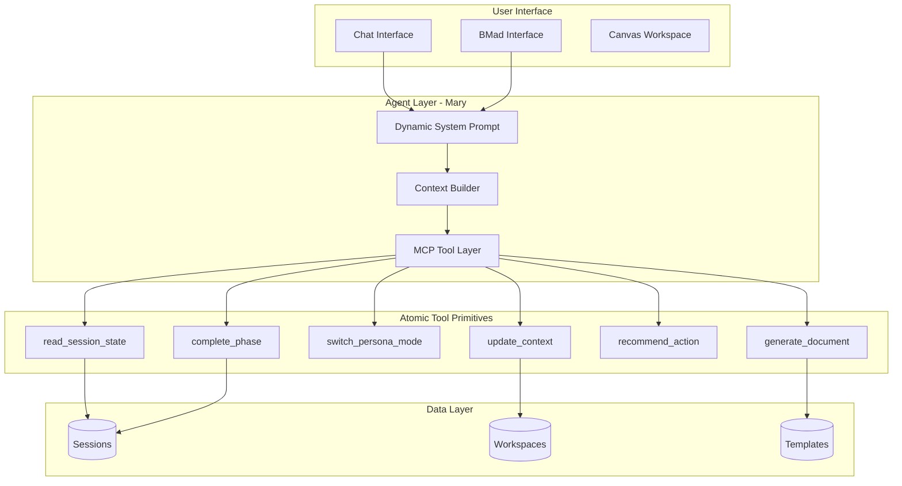

# Agent-Native Architecture Evolution for ThinkHaven

## Executive Summary

After reviewing ThinkHaven's current architecture and the Every.to Agent-Native Implementation Guide, I've identified significant opportunities to make Mary (the AI coach) dramatically more powerful, composable, and capable of emergent behavior. The current implementation embeds workflow logic in code; the agent-native approach moves judgment to prompts and gives the agent atomic tools to accomplish outcomes.

## Current State Assessment

### What ThinkHaven Has Today

- **Claude Sonnet 4 Integration**: Working streaming chat with Mary persona
- **BMad Method Framework**: 3 pathways with template-driven sessions
- **Session Orchestrator**: Manages phases, progress tracking, transitions
- **Dual-Pane UI**: Chat + Canvas (canvas placeholder)
- **Supabase Backend**: Auth, workspaces, conversations, sessions

### Agent-Native Principle Violations

| Principle | Current State | Gap |

|-----------|--------------|-----|

| **Parity** | UI can select pathways, advance sessions, pause/resume | Mary has no access to these actions; she only responds |

| **Granularity** | `advanceSession` bundles analysis + completion + transition | Should be atomic: `read_phase`, `complete_phase`, `switch_mode` |

| **Composability** | New features require code changes | New coaching styles should be prompt changes |

| **Context Injection** | Static Mary persona prompt | No dynamic workspace state, user history, session progress |

| **Completion Signals** | Heuristic-based (keyword matching) | Agent should explicitly signal completion |

| **Emergent Capability** | Agent can't handle unexpected requests | Everything routes through fixed pathways |

---

## Transformation Strategy

### Phase 1: Parity Layer (MCP Tools)

Give Mary tools that match UI capabilities. Create atomic primitives in an MCP server:

```
Core Session Tools:
- read_session_state      # What phase, progress, context
- read_user_context       # Preferences, history, expertise level
- complete_phase          # Explicit completion signal
- switch_persona_mode     # Toggle Inquisitive/Devil's Advocate/etc
- update_session_context  # Add insights to session memory
- generate_document       # Create Lean Canvas, PRD, etc
- recommend_action        # Kill/Pivot/Continue with score
```

**Key Files to Modify:**

- Create new [`lib/mcp/bmad-tools.ts`](lib/mcp/bmad-tools.ts) for tool definitions
- Extend [`lib/ai/claude-client.ts`](lib/ai/claude-client.ts) with tool calling support
- Add tool invocation in [`app/api/chat/stream/route.ts`](app/api/chat/stream/route.ts)

### Phase 2: Context Injection (context.md Pattern)

Replace static Mary persona with dynamic system prompt that includes:

```markdown
## Session State
- Pathway: Business Model Analysis
- Current Phase: Revenue Model Validation (Phase 3/5)
- Progress: 65% complete
- Sub-Persona Mode: Devil's Advocate (35% weight)

## User Context
- Name: Kevin
- Expertise: Advanced (healthcare data products)
- Previous sessions: 3 completed
- Last session: "InstantDoc pricing strategy" (2 days ago)

## Available Capabilities
- Complete current phase
- Switch to Encouraging mode (if user seems defensive)
- Generate partial Lean Canvas
- Recommend kill decision (viability score: 4.2/10)

## Recent Conversation Insights
- User has strong technical assumptions
- Revenue model unclear ("figure it out later" pattern)
- Competitor research incomplete
```

**Key Files to Modify:**

- Create [`lib/ai/context-builder.ts`](lib/ai/context-builder.ts) for dynamic prompt generation
- Update [`lib/ai/claude-client.ts`](lib/ai/claude-client.ts) `getMaryPersonaPrompt()` to be dynamic

### Phase 3: Sub-Persona as Prompts

The current Epic structure describes a sub-persona system with mode weighting. Implement this as prompt engineering, not code logic:

```
# Mode: Devil's Advocate (Active)
Your current focus is challenging assumptions and stress-testing ideas.
- Probe revenue model weaknesses
- Question market size assumptions  
- Push back on "build it and they will come" thinking
- Earn the right to recommend killing the idea by doing thorough analysis first

# Escalation Sequence (for weak ideas)
1. Diplomatic flags → "I notice some gaps in..."
2. Deeper probe → "Help me understand how..."
3. Explicit recommendation → "Based on our analysis, the viability score is..."
4. Kill decision → Clear recommendation with reasoning
```

### Phase 4: Atomic Primitives Refactor

Transform [`lib/bmad/session-orchestrator.ts`](lib/bmad/session-orchestrator.ts) from workflow engine to tool provider:

**Current (Wrong - Bundles Judgment):**

```typescript
async advanceSession(sessionId: string, userInput: string) {
  // Analyzes input
  // Checks completion (heuristic)
  // Determines next action
  // Updates state
}
```

**Agent-Native (Right - Agent Decides):**

```typescript
// Atomic tools for agent to compose
async readPhaseState(sessionId: string): PhaseState
async recordInsight(sessionId: string, insight: Insight): void
async completePhase(sessionId: string, reason: string): PhaseResult
async switchMode(sessionId: string, mode: SubPersonaMode): void
async generateDocument(sessionId: string, type: DocumentType): Document
```

### Phase 5: Dynamic Capability Discovery

Instead of hardcoded pathways, let Mary discover what's available:

```typescript
// Tools that expose capabilities at runtime
async listAvailablePathways(): Pathway[]
async listPhaseActions(phaseId: string): Action[]
async listDocumentTypes(): DocumentType[]
```

Mary can then compose solutions for requests you didn't explicitly build features for.

---

## Architecture Diagram



---

## Implementation Priority

### Highest Leverage (Do First)

1. **Context Injection** - Makes Mary immediately smarter with no tool complexity
2. **Sub-Persona Prompts** - Enables the "encouraged AND challenged" experience
3. **Explicit Completion Tool** - Removes heuristic guessing

### High Value (Do Second)

4. **MCP Tool Layer** - Full parity with UI capabilities
5. **Dynamic Prompt Builder** - Workspace state in system prompt
6. **Kill Recommendation Tool** - Anti-sycophancy as agent judgment

### Composability Enablers (Do Third)

7. **Atomic Primitive Refactor** - Break apart SessionOrchestrator
8. **Dynamic Capability Discovery** - Agent learns what's possible
9. **Files as Interface** - Session state as readable context files

---

## Success Test (From Agent-Native Guide)

> "Describe an outcome in your domain that you didn't build a feature for. Can the agent figure it out in a loop until success?"

**Example Test for ThinkHaven:**

- User: "I want to compare my idea to what we discussed last month and see if my assumptions have gotten stronger or weaker"
- Agent-Native Mary would: Read previous session context, analyze assumption evolution, generate comparison document
- Current Mary: Cannot access previous sessions or generate comparison

---

## Specific Code Changes

### 1. Context Builder (New File)

Create [`lib/ai/context-builder.ts`](lib/ai/context-builder.ts):

- `buildSessionContext(sessionId)` - Current phase, progress, mode
- `buildUserContext(userId)` - History, preferences, expertise
- `buildCapabilityContext()` - What Mary can do right now

### 2. Tool Definitions (New File)

Create [`lib/mcp/bmad-tools.ts`](lib/mcp/bmad-tools.ts):

- Define atomic tools following MCP schema
- Implement tool handlers that call existing lib/bmad functions

### 3. Claude Client Enhancement

Modify [`lib/ai/claude-client.ts`](lib/ai/claude-client.ts):

- Accept dynamic context instead of static prompt
- Add tool_use capability for Claude
- Handle tool calls in streaming response

### 4. API Route Enhancement

Modify [`app/api/chat/stream/route.ts`](app/api/chat/stream/route.ts):

- Build context before Claude call
- Handle tool invocation loop
- Return tool results alongside text

---

## Questions Before Implementation

1. **MCP Integration Approach**: Should Mary's tools be exposed via MCP server (for external agent use) or integrated directly into the chat API route (simpler)?

2. **Sub-Persona Trigger Logic**: Should mode switching be entirely agent-driven ("Mary senses you're defensive") or should users have explicit control ("Switch to Encouraging mode")?

3. **Canvas Integration**: The canvas is currently a placeholder. Should agent-native tools include canvas manipulation (create diagram, add element), or is that post-MVP?

4. **Session Persistence**: Current sessions use Supabase. Should tool state and context also persist to allow true session resume with full agent context?