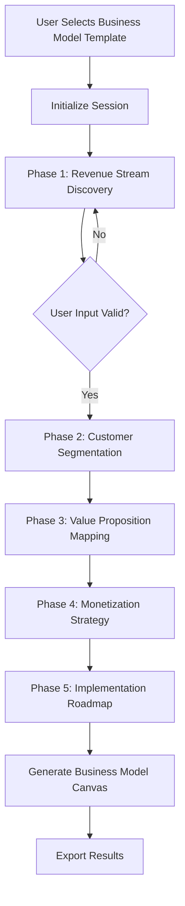

# Epic 2: BMAD Pathways - Implementation Preparation

**Last Updated**: 2025-09-30
**Status**: Ready for Implementation
**Priority**: High

---

## Executive Summary

Epic 2 focuses on implementing strategic thinking pathways using the BMAD Method framework. This represents the core value proposition of ThinkHaven: transforming AI chat into structured strategic coaching.

**Current State**: Foundation complete (Auth, Claude integration, Chat UI)
**Target State**: Functional BMAD pathways with business model analysis
**Timeline Estimate**: 3-4 weeks (7 stories)

---

## Epic 2 Stories Overview

### Completed Stories
✅ **Story 2.1**: Pathway Selection & Routing Interface
✅ **Story 2.2**: New Idea Creative Expansion Pathway
✅ **Story 2.5**: Pathway Integration & Session State Management

### Ready for Implementation
⏳ **Story 2.3**: Business Model Problem Revenue Analysis Pathway
⏳ **Story 2.4a-d**: Feature Refinement & User-Centered Design (4 sub-stories)
⏳ **Story 5.1**: Business Model Assumption Testing Framework

---

## Technical Foundation Review

### ✅ Infrastructure Ready
- **Claude Sonnet 4 Integration**: Streaming, context management, persona handling
- **Database Schema**: Workspace, conversations, messages, bmad_sessions tables
- **Component Architecture**: Chat interface, message handling, UI components
- **Auth System**: Supabase OAuth, session management, RLS policies

### ⚠️ BMAD-Specific Gaps
1. **Template System**: No frontend implementation of BMAD templates
2. **Pathway Orchestration**: Missing structured coaching flow logic
3. **Analysis Engine**: No business model analysis components
4. **State Management**: BMAD-specific session state not implemented
5. **UI Components**: Template selectors, analysis displays need creation

---

## Priority 1: Story 2.3 - Business Model Pathway

### Why This Story First?
- Most valuable pathway for users (revenue/monetization focus)
- Demonstrates full BMAD integration pattern
- Establishes template system architecture
- High user demand based on market research

### Implementation Components

#### 1. BMAD Template System
**Files to Create:**
```
apps/web/lib/bmad/
├── templates/
│   ├── business-model-canvas.ts
│   ├── revenue-analysis.ts
│   └── template-manager.ts
├── engines/
│   ├── revenue-stream-analyzer.ts
│   ├── customer-segment-mapper.ts
│   └── monetization-strategist.ts
└── orchestration/
    ├── pathway-orchestrator.ts
    └── session-manager.ts
```

#### 2. Frontend Components
**Files to Create:**
```
apps/web/app/components/bmad/
├── TemplateSelector.tsx
├── BusinessModelCanvas.tsx
├── RevenueAnalysisPanel.tsx
├── PathwayProgressTracker.tsx
└── AnalysisResultDisplay.tsx
```

#### 3. API Routes
**Files to Create:**
```
apps/web/app/api/bmad/
├── templates/route.ts
├── analyze/route.ts
├── session/route.ts
└── export/route.ts
```

#### 4. Database Extensions
**Migration Needed:**
```sql
-- Add BMAD-specific columns to bmad_sessions table
ALTER TABLE bmad_sessions ADD COLUMN template_id TEXT;
ALTER TABLE bmad_sessions ADD COLUMN phase_data JSONB DEFAULT '{}';
ALTER TABLE bmad_sessions ADD COLUMN analysis_results JSONB DEFAULT '{}';
ALTER TABLE bmad_sessions ADD COLUMN completion_percentage INTEGER DEFAULT 0;

-- Create pathway_templates table
CREATE TABLE pathway_templates (
  id UUID PRIMARY KEY DEFAULT gen_random_uuid(),
  name TEXT NOT NULL,
  category TEXT NOT NULL,
  structure JSONB NOT NULL,
  prompts JSONB NOT NULL,
  created_at TIMESTAMPTZ DEFAULT NOW()
);
```

---

## Implementation Strategy

### Phase 1: Foundation (Week 1)
**Goal**: Template system and orchestration core

1. **Template Manager** (`lib/bmad/templates/template-manager.ts`)
   - Load/parse template definitions
   - Validate template structure
   - Template versioning support

2. **Pathway Orchestrator** (`lib/bmad/orchestration/pathway-orchestrator.ts`)
   - Phase progression logic
   - Context management between phases
   - Integration with Claude client

3. **Database Migration**
   - Run bmad_sessions schema updates
   - Create pathway_templates table
   - Seed initial templates

**Acceptance Criteria**:
- [ ] Template manager loads Business Model Canvas template
- [ ] Orchestrator progresses through mock phases
- [ ] Database stores session progress correctly

### Phase 2: Analysis Engine (Week 2)
**Goal**: Business model analysis intelligence

1. **Revenue Stream Analyzer** (`lib/bmad/engines/revenue-stream-analyzer.ts`)
   - Parse user revenue model descriptions
   - Identify revenue stream categories
   - Feasibility scoring logic

2. **Customer Segment Mapper** (`lib/bmad/engines/customer-segment-mapper.ts`)
   - Extract customer segments from conversations
   - Map value propositions to segments
   - CLV/CAC estimation logic

3. **Monetization Strategist** (`lib/bmad/engines/monetization-strategist.ts`)
   - Pricing model recommendations
   - Revenue optimization strategies
   - Competitive analysis integration

**Acceptance Criteria**:
- [ ] Revenue analyzer identifies 3+ revenue streams from user input
- [ ] Customer mapper creates segment-to-value-prop matrix
- [ ] Strategist generates 5+ actionable monetization recommendations

### Phase 3: UI Integration (Week 3)
**Goal**: User-facing BMAD experience

1. **Template Selector Component**
   - Display available templates
   - Category filtering
   - Template preview

2. **Business Model Canvas Component**
   - Interactive canvas UI
   - Real-time AI-assisted filling
   - Export to image/PDF

3. **Analysis Result Display**
   - Structured insights presentation
   - Visual data representations
   - Action item extraction

**Acceptance Criteria**:
- [ ] Users can select Business Model template from UI
- [ ] Canvas fills progressively during chat session
- [ ] Analysis results render with clear visualizations

### Phase 4: Integration & Polish (Week 4)
**Goal**: End-to-end pathway completion

1. **API Route Implementation**
   - Template CRUD operations
   - Analysis execution endpoints
   - Session persistence

2. **Chat Interface Integration**
   - Pathway-aware message handling
   - Phase transition UX
   - Progress indicators

3. **Testing & Validation**
   - Unit tests for engines
   - Integration tests for full pathway
   - E2E user journey tests

**Acceptance Criteria**:
- [ ] Complete business model session works end-to-end
- [ ] Session state persists across page refreshes
- [ ] Users can export completed Business Model Canvas

---

## Story 2.3 Technical Specifications

### Template Structure
```typescript
interface PathwayTemplate {
  id: string
  name: string
  category: 'business-model' | 'feature-refinement' | 'new-idea'
  phases: PathwayPhase[]
  metadata: TemplateMetadata
}

interface PathwayPhase {
  id: string
  name: string
  description: string
  systemPrompt: string
  userGuidance: string
  expectedOutputs: string[]
  validationRules: ValidationRule[]
}

interface TemplateMetadata {
  estimatedDuration: number // minutes
  difficulty: 'beginner' | 'intermediate' | 'advanced'
  prerequisites: string[]
  tags: string[]
}
```

### Orchestration Flow


### Analysis Engine Integration
```typescript
// Example: Revenue Stream Analyzer
class RevenueStreamAnalyzer {
  async analyze(conversationContext: ConversationMessage[]): Promise<RevenueAnalysis> {
    // Extract revenue mentions from conversation
    const streams = await this.extractStreams(conversationContext)

    // Score feasibility of each stream
    const scored = await this.scoreStreams(streams)

    // Generate recommendations
    const recommendations = await this.generateRecommendations(scored)

    return {
      identifiedStreams: streams,
      feasibilityScores: scored,
      recommendations: recommendations,
      nextSteps: this.prioritizeNextSteps(scored)
    }
  }
}
```

---

## Dependencies & Blockers

### External Dependencies
- ✅ Anthropic Claude API (functional)
- ✅ Supabase Database (functional)
- ⚠️ Business Model Canvas export library (need to choose)

### Internal Dependencies
- ✅ Story 1.4: Claude integration complete
- ✅ Story 2.1: Pathway selection UI complete
- ✅ Story 2.5: Session state management complete

### Potential Blockers
1. **Canvas Export**: Need to select library (html2canvas vs custom SVG)
2. **Template Storage**: Decide file-based vs database templates
3. **Analysis Accuracy**: May need prompt engineering iteration

---

## Success Metrics

### Story 2.3 Definition of Done
- [ ] User can complete full Business Model pathway session
- [ ] Revenue analysis identifies 3+ streams with 85%+ accuracy
- [ ] Customer segmentation maps to 3+ segments
- [ ] Monetization strategy generates 5+ actionable recommendations
- [ ] Business Model Canvas exports as PDF/image
- [ ] Session state persists and recovers correctly
- [ ] 70%+ test coverage for BMAD modules
- [ ] Performance: Pathway completion <20 minutes

### User Experience Metrics
- Time to complete pathway: <20 minutes
- User satisfaction: 4.0+ / 5.0
- Completion rate: >60%
- Export usage: >40% of completed sessions

---

## Risk Mitigation

### Technical Risks
| Risk | Impact | Probability | Mitigation |
|------|--------|-------------|------------|
| Claude API rate limits | High | Low | Implement request queuing, user feedback |
| Complex template logic | Medium | Medium | Start with simple templates, iterate |
| State management bugs | High | Medium | Comprehensive testing, auto-save every 30s |
| Export quality issues | Low | Medium | Multiple export format options |

### Product Risks
| Risk | Impact | Probability | Mitigation |
|------|--------|-------------|------------|
| User confusion | High | Medium | Clear onboarding, tooltips, examples |
| Low pathway completion | High | Medium | Progress indicators, save/resume |
| Inaccurate analysis | Medium | High | Human-in-loop validation, confidence scores |

---

## Next Steps

### Immediate Actions (This Week)
1. **Set up BMAD library structure** - Create folder hierarchy
2. **Design template JSON schema** - Define standard template format
3. **Create Business Model Canvas template** - First working template
4. **Implement basic template manager** - Load/validate templates

### Week 2 Actions
1. Begin revenue stream analyzer implementation
2. Create unit tests for template system
3. Design UI mockups for template selector
4. Database migration for bmad_sessions

### Week 3 Actions
1. Implement customer segmentation logic
2. Build TemplateSelector React component
3. Integrate with existing chat interface
4. Create analysis result display components

### Week 4 Actions
1. End-to-end integration testing
2. Performance optimization
3. User testing with real scenarios
4. Documentation and deployment

---

## Resources

### Code References
- **Existing BMAD Code**: `apps/web/lib/bmad/` (placeholder structure exists)
- **Chat Integration**: `apps/web/app/components/chat/ChatInterface.tsx`
- **Session Management**: `apps/web/lib/stores/` (Zustand stores)

### Documentation References
- **Story 2.3 Full Details**: `docs/stories/epic-2-bmad-pathways/2.3.business-model-problem-revenue-analysis-pathway.md`
- **Architecture Doc**: `docs/architecture.md` (Section: BMad Integration)
- **Database Schema**: `supabase/schema.sql`

### External Resources
- Business Model Canvas: https://strategyzer.com/canvas
- Lean Canvas: https://leanstack.com/lean-canvas
- Revenue Model Patterns: Book - "Business Model Generation"

---

## Questions for PM / Stakeholders

1. **Template Priority**: Should we implement Story 2.4 (Feature Refinement) or 5.1 (Assumption Testing) next after 2.3?
2. **Export Format**: PDF only, or also support PPTX/Miro board export?
3. **Collaboration**: Should BMAD sessions support multi-user collaboration (future)?
4. **Pricing**: Should BMAD pathways be premium features or included in free tier?

---

**Status**: Ready for development kickoff
**Assigned**: TBD
**Target Sprint**: Sprint 5 (Starting 2025-10-01)