# thinkhaven Fullstack Architecture Document

## Introduction

This document outlines the complete fullstack architecture for thinkhaven AI Product Coaching Platform, including backend systems, frontend implementation, and their integration. It serves as the single source of truth for AI-driven development, ensuring consistency across the entire technology stack.

This unified approach combines what would traditionally be separate backend and frontend architecture documents, streamlining the development process for our modern fullstack application where these concerns are increasingly intertwined.

### Starter Template or Existing Project

**Base**: Next.js 15 application with custom dual-pane architecture
- **Framework**: Next.js 15 with App Router and Turbopack
- **Constraints**: Existing Supabase integration must be maintained
- **Architectural Decisions**: Dual-pane interface pattern, AI-first design, BMad strategic framework integration
- **What can be modified**: Canvas implementation, BMad-Chat bridge, advanced features
- **What must be retained**: Authentication system, database schema, Claude integration patterns

### Change Log

| Date       | Version | Description                           | Author         |
| ---------- | ------- | ------------------------------------- | -------------- |
| 2025-09-05 | 1.0     | Initial fullstack architecture document | Winston (Architect) |
| 2025-09-05 | 1.1     | Updated to Claude Sonnet 4.0 API specification | Winston (Architect) |

## High Level Architecture

### Technical Summary

The thinkhaven platform implements a **modern serverless-first architecture** with a dual-pane user interface for AI-powered strategic coaching. The architecture leverages Next.js 15's App Router for both frontend and API layers, integrating with Supabase for data persistence and real-time features, and Anthropic Claude Sonnet 4.0 for AI coaching capabilities. The system follows a **component-based frontend architecture** with **API-first backend design**, enabling seamless AI conversation streaming while maintaining strategic business analysis capabilities through the integrated BMad Method framework.

### Platform and Infrastructure Choice

**Platform:** Vercel + Supabase
**Key Services:** Vercel Edge Functions, Supabase Database/Auth/Storage, Anthropic Claude API
**Deployment Host and Regions:** Global CDN with edge compute, multi-region database replication

**Rationale:** This combination provides optimal developer experience, automatic scaling, and integrated auth/database/real-time features perfect for AI-powered applications.

### Repository Structure

**Structure:** Monorepo with npm workspaces
**Monorepo Tool:** npm workspaces (built-in)
**Package Organization:** Apps (web), Packages (shared utilities), Framework definitions (.bmad-core)

### High Level Architecture Diagram

```mermaid
graph TB
    User[👤 User] --> Web[Next.js Web App]
    Web --> Auth[Supabase Auth]
    Web --> API[Next.js API Routes]
    
    API --> Claude[Anthropic Claude API]
    API --> DB[(Supabase Database)]
    API --> Storage[(Supabase Storage)]
    
    subgraph "Frontend Components"
        Web --> Chat[Chat Interface]
        Web --> Canvas[Canvas Workspace]
        Web --> BMad[BMad Interface]
    end
    
    subgraph "AI Integration Layer"
        Claude --> Persona[Mary Coaching Persona]
        Claude --> Stream[Server-Sent Events]
    end
    
    subgraph "Data Layer"
        DB --> Conversations[Conversations]
        DB --> Workspaces[Workspaces]  
        DB --> BMadData[BMad Analysis Data]
    end
    
    Web --> CDN[Vercel CDN/Edge]
    API --> Functions[Vercel Edge Functions]
```



### Architectural Patterns

- **Jamstack Architecture:** Static generation with serverless APIs - _Rationale:_ Optimal performance and global distribution for AI chat applications
- **Component-Based UI:** Reusable React components with TypeScript - _Rationale:_ Maintainability and type safety across dual-pane interface
- **API-First Backend:** RESTful endpoints with streaming support - _Rationale:_ Enables real-time AI conversation while maintaining clean separation
- **Event-Driven Architecture:** Server-Sent Events for real-time updates - _Rationale:_ Superior to WebSockets for AI streaming with built-in reconnection
- **Domain-Driven Design:** Clear separation between AI, BMad, and Workspace domains - _Rationale:_ Supports complex strategic coaching workflows

## Tech Stack

### Technology Stack Table

| Category             | Technology      | Version | Purpose                        | Rationale                                    |
| -------------------- | --------------- | ------- | ------------------------------ | -------------------------------------------- |
| Frontend Language    | TypeScript      | 5.x     | Type-safe frontend development | Essential for AI integration complexity      |
| Frontend Framework   | Next.js         | 15.5.0  | React framework with SSR/SSG   | App Router + Turbopack for optimal performance |
| UI Framework         | React           | 19.1.0  | Component-based UI             | Latest with concurrent features for AI streaming |
| UI Component Library | Custom + Tailwind | 4.0    | Design system implementation   | Tailwind 4.0 with container queries         |
| State Management     | Zustand         | 5.0.8   | Lightweight state management   | Perfect for dual-pane coordination          |
| Backend Language     | TypeScript      | 5.x     | Full-stack type safety         | Shared types between frontend/backend       |
| Backend Framework    | Next.js API     | 15.5.0  | Serverless API endpoints       | Integrated with frontend, edge deployment   |
| API Style            | REST + SSE      | -       | RESTful with real-time streaming | Server-Sent Events for AI conversation     |
| Database             | Supabase        | 2.56.0  | PostgreSQL with real-time      | Integrated auth, real-time, vector support |
| Cache                | Vercel Cache    | -       | Edge caching                   | Built-in CDN caching for static assets     |
| File Storage         | Supabase Storage | 2.56.0 | User files and exports         | Integrated with database and auth           |
| Authentication       | Supabase Auth   | 2.56.0  | User management and sessions   | Row Level Security, social auth support    |
| AI Integration       | Anthropic Claude | 0.27.3 | Strategic coaching AI          | Sonnet 4.0 with streaming capabilities     |
| Frontend Testing     | Vitest          | 3.2.4   | Fast unit testing              | Modern alternative to Jest                  |
| Backend Testing      | Vitest          | 3.2.4   | API endpoint testing           | Unified testing framework                   |
| E2E Testing          | Playwright      | Latest  | End-to-end user flows          | AI conversation flow testing               |
| Build Tool           | Turbopack       | Latest  | Fast development builds        | Next.js 15 integrated bundler             |
| Bundler              | Turbopack       | Latest  | Production bundling            | Rust-based bundler for speed              |
| IaC Tool             | Vercel CLI      | Latest  | Deployment configuration       | Platform-native deployment                |
| CI/CD                | GitHub Actions  | -       | Automated deployment           | Integrated with Vercel deployment         |
| Monitoring           | Vercel Analytics | -      | Performance and errors         | Built-in monitoring and logging           |
| Logging              | Vercel Logs     | -       | Application logging            | Serverless function logs                  |
| CSS Framework        | Tailwind CSS    | 4.0     | Utility-first styling          | Container queries, modern CSS features   |

## Data Models

### Core Business Entities

The system centers around strategic coaching sessions with persistent conversation history and business analysis capabilities.

#### User

**Purpose:** Authentication and workspace ownership with coaching preferences

**Key Attributes:**
- id: string - Supabase user identifier
- email: string - Primary authentication
- profile: UserProfile - Coaching preferences and session history
- created_at: timestamp - Account creation date

**TypeScript Interface:**
```typescript
interface User {
  id: string;
  email: string;
  profile?: UserProfile;
  created_at: string;
  updated_at: string;
}

interface UserProfile {
  display_name?: string;
  coaching_preferences?: CoachingPreferences;
  bmad_expertise_level?: 'beginner' | 'intermediate' | 'advanced';
}
```

**Relationships:**
- One-to-many with Workspaces
- One-to-many with Conversations

#### Workspace

**Purpose:** Container for strategic thinking sessions combining chat and canvas elements

**Key Attributes:**
- id: string - Unique workspace identifier  
- name: string - User-defined workspace title
- description: string - Workspace purpose and context
- dual_pane_state: DualPaneState - Current interface configuration
- bmad_context: BMadContext - Strategic analysis state

**TypeScript Interface:**
```typescript
interface Workspace {
  id: string;
  user_id: string;
  name: string;
  description?: string;
  dual_pane_state: DualPaneState;
  bmad_context?: BMadContext;
  canvas_elements: CanvasElement[];
  chat_context: ChatMessage[];
  created_at: string;
  updated_at: string;
}

interface DualPaneState {
  chat_width: number;
  canvas_width: number;
  active_pane: 'chat' | 'canvas';
  collapsed: boolean;
}
```

**Relationships:**
- Belongs-to User
- One-to-many with Conversations
- One-to-many with CanvasElements

#### Conversation

**Purpose:** AI coaching conversation history with context and strategic insights

**Key Attributes:**
- id: string - Unique conversation identifier
- workspace_id: string - Associated workspace
- title: string - Conversation summary title
- messages: Message[] - Chat message history
- coaching_context: CoachingContext - Mary persona context
- bmad_session_id: string - Associated strategic analysis session

**TypeScript Interface:**
```typescript
interface Conversation {
  id: string;
  user_id: string;
  workspace_id: string;
  title?: string;
  context_summary?: string;
  coaching_context: CoachingContext;
  bmad_session_id?: string;
  message_count: number;
  total_tokens: number;
  created_at: string;
  updated_at: string;
}

interface CoachingContext {
  session_goals?: string[];
  current_phase?: string;
  strategic_focus?: string;
  personality_insights?: Record<string, any>;
}
```

**Relationships:**
- Belongs-to User
- Belongs-to Workspace
- One-to-many with Messages
- Optional relationship with BMadSession

#### Message

**Purpose:** Individual chat messages with AI coaching responses and metadata

**Key Attributes:**
- id: string - Message identifier
- conversation_id: string - Parent conversation
- role: 'user' | 'assistant' - Message author
- content: string - Message text content
- token_usage: TokenUsage - API usage tracking
- strategic_tags: string[] - BMad method tagging

**TypeScript Interface:**
```typescript
interface Message {
  id: string;
  conversation_id: string;
  role: 'user' | 'assistant' | 'system';
  content: string;
  token_usage?: TokenUsage;
  strategic_tags?: string[];
  bookmarked: boolean;
  references?: MessageReference[];
  created_at: string;
}

interface TokenUsage {
  input_tokens: number;
  output_tokens: number;
  total_tokens: number;
  cost_estimate_usd?: number;
}
```

**Relationships:**
- Belongs-to Conversation
- Optional many-to-many with MessageReferences

## API Specification

### REST API Specification

```yaml
openapi: 3.0.0
info:
  title: thinkhaven AI Coaching Platform API
  version: 1.0.0
  description: RESTful API for AI-powered strategic coaching platform with real-time streaming
servers:
  - url: /api
    description: Next.js API routes

paths:
  /chat/stream:
    post:
      summary: Stream AI coaching conversation
      description: Real-time Claude Sonnet 4.0 streaming with Mary persona
      requestBody:
        required: true
        content:
          application/json:
            schema:
              type: object
              properties:
                message:
                  type: string
                  description: User message for coaching
                workspaceId:
                  type: string
                  description: Active workspace context
                conversationHistory:
                  type: array
                  items:
                    $ref: '#/components/schemas/ConversationMessage'
                coachingContext:
                  $ref: '#/components/schemas/CoachingContext'
      responses:
        '200':
          description: Server-sent event stream
          content:
            text/event-stream:
              schema:
                type: string
                description: SSE stream with AI responses
  
  /workspaces:
    get:
      summary: List user workspaces
      responses:
        '200':
          description: Array of workspaces
          content:
            application/json:
              schema:
                type: array
                items:
                  $ref: '#/components/schemas/Workspace'
    post:
      summary: Create new workspace
      requestBody:
        required: true
        content:
          application/json:
            schema:
              type: object
              properties:
                name:
                  type: string
                description:
                  type: string
      responses:
        '201':
          description: Created workspace
          content:
            application/json:
              schema:
                $ref: '#/components/schemas/Workspace'

  /bmad/templates:
    get:
      summary: Get strategic thinking templates
      parameters:
        - name: category
          in: query
          schema:
            type: string
            enum: [new-idea, business-model, competitive-analysis]
      responses:
        '200':
          description: Available BMad templates
          content:
            application/json:
              schema:
                type: array
                items:
                  $ref: '#/components/schemas/BMadTemplate'

components:
  schemas:
    Workspace:
      type: object
      properties:
        id:
          type: string
        name:
          type: string
        description:
          type: string
        dual_pane_state:
          $ref: '#/components/schemas/DualPaneState'
    
    CoachingContext:
      type: object
      properties:
        session_goals:
          type: array
          items:
            type: string
        current_phase:
          type: string
        strategic_focus:
          type: string
    
    ConversationMessage:
      type: object
      properties:
        role:
          type: string
          enum: [user, assistant]
        content:
          type: string
```

## Components

### Chat Interface Component

**Responsibility:** Real-time AI conversation interface with streaming responses and message management

**Key Interfaces:**
- ChatMessage props with SSE streaming
- ConversationHistory management with pagination
- MessageInput with validation and submission
- BookmarkSystem for message references

**Dependencies:** Claude client, Conversation persistence, State management
**Technology Stack:** React 19 with Server-Sent Events, Zustand for state, TypeScript for type safety

### Canvas Workspace Component

**Responsibility:** Visual workspace for strategic thinking with drawing tools and element persistence

**Key Interfaces:**
- CanvasElement creation and manipulation
- Drawing tool palette and controls
- Element persistence to Supabase
- Real-time collaboration support

**Dependencies:** Canvas rendering library, Workspace state, Database persistence
**Technology Stack:** HTML5 Canvas or SVG, custom drawing tools, real-time state sync

### BMad Strategic Framework Component

**Responsibility:** Structured strategic thinking templates integrated with AI coaching conversations

**Key Interfaces:**
- Template selection and customization
- Strategic analysis engine integration
- Context bridge with coaching conversation
- Document generation and export

**Dependencies:** BMad analysis engines, Template system, Chat context bridge
**Technology Stack:** React components with strategic analysis TypeScript modules

### AI Coaching Service

**Responsibility:** Claude Sonnet 4.0 integration with Mary coaching persona and context management

**Key Interfaces:**
- Streaming conversation API with SSE
- Persona context management
- Token usage tracking and optimization
- Error handling and retry logic

**Dependencies:** Anthropic SDK, Conversation persistence, Context management
**Technology Stack:** Next.js API routes, Anthropic Claude SDK, Server-Sent Events

### Database Service Layer

**Responsibility:** Supabase integration with conversation persistence, user management, and real-time features

**Key Interfaces:**
- User authentication and profile management
- Conversation CRUD with search capabilities
- Workspace state persistence
- Real-time subscription management

**Dependencies:** Supabase client, Row Level Security policies, Database schema
**Technology Stack:** Supabase SDK, PostgreSQL with RLS, TypeScript query builders

### Component Diagrams


## External APIs

### Anthropic Claude API

- **Purpose:** AI-powered strategic coaching with streaming responses
- **Documentation:** https://docs.anthropic.com/claude/reference
- **Base URL(s):** https://api.anthropic.com/v1
- **Authentication:** API Key with Bearer token
- **Rate Limits:** Based on subscription tier, token-based pricing

**Key Endpoints Used:**
- `POST /messages` - Create streaming conversation with Claude Sonnet 4.0
- `POST /messages/stream` - Server-sent events for real-time responses

**Integration Notes:** Uses streaming for real-time coaching experience, implements token usage tracking, includes Mary coaching persona in system prompt

## Core Workflows

### AI Coaching Conversation Flow


### Workspace Creation and Management Flow


## Database Schema

```sql
-- Users (managed by Supabase Auth)
-- Workspaces table
CREATE TABLE workspaces (
  id UUID DEFAULT gen_random_uuid() PRIMARY KEY,
  user_id UUID REFERENCES auth.users(id) ON DELETE CASCADE,
  name TEXT NOT NULL,
  description TEXT,
  dual_pane_state JSONB DEFAULT '{"chat_width": 50, "canvas_width": 50, "active_pane": "chat", "collapsed": false}',
  bmad_context JSONB,
  canvas_elements JSONB DEFAULT ''[]'',
  chat_context JSONB DEFAULT ''[]'',
  created_at TIMESTAMPTZ DEFAULT NOW(),
  updated_at TIMESTAMPTZ DEFAULT NOW()
);

-- Conversations table
CREATE TABLE conversations (
  id UUID DEFAULT gen_random_uuid() PRIMARY KEY,
  user_id UUID REFERENCES auth.users(id) ON DELETE CASCADE,
  workspace_id UUID REFERENCES workspaces(id) ON DELETE CASCADE,
  title TEXT,
  context_summary TEXT,
  coaching_context JSONB DEFAULT '{}',
  bmad_session_id UUID,
  message_count INTEGER DEFAULT 0,
  total_tokens INTEGER DEFAULT 0,
  metadata JSONB DEFAULT '{}',
  created_at TIMESTAMPTZ DEFAULT NOW(),
  updated_at TIMESTAMPTZ DEFAULT NOW()
);

-- Messages table
CREATE TABLE messages (
  id UUID DEFAULT gen_random_uuid() PRIMARY KEY,
  conversation_id UUID REFERENCES conversations(id) ON DELETE CASCADE,
  role TEXT CHECK (role IN ('user', 'assistant', 'system')),
  content TEXT NOT NULL,
  token_usage JSONB,
  strategic_tags TEXT[],
  bookmarked BOOLEAN DEFAULT FALSE,
  references JSONB DEFAULT ''[]'',
  metadata JSONB DEFAULT '{}',
  created_at TIMESTAMPTZ DEFAULT NOW()
);

-- BMad Sessions table
CREATE TABLE bmad_sessions (
  id UUID DEFAULT gen_random_uuid() PRIMARY KEY,
  user_id UUID REFERENCES auth.users(id) ON DELETE CASCADE,
  workspace_id UUID REFERENCES workspaces(id) ON DELETE CASCADE,
  template_type TEXT NOT NULL,
  analysis_data JSONB DEFAULT '{}',
  generated_documents JSONB DEFAULT ''[]'',
  status TEXT DEFAULT 'active',
  created_at TIMESTAMPTZ DEFAULT NOW(),
  updated_at TIMESTAMPTZ DEFAULT NOW()
);

-- Row Level Security Policies
ALTER TABLE workspaces ENABLE ROW LEVEL SECURITY;
ALTER TABLE conversations ENABLE ROW LEVEL SECURITY;
ALTER TABLE messages ENABLE ROW LEVEL SECURITY;
ALTER TABLE bmad_sessions ENABLE ROW LEVEL SECURITY;

-- Policies for user data isolation
CREATE POLICY "Users can manage their own workspaces" ON workspaces
  FOR ALL USING (auth.uid() = user_id);

CREATE POLICY "Users can manage their own conversations" ON conversations
  FOR ALL USING (auth.uid() = user_id);

CREATE POLICY "Users can access messages from their conversations" ON messages
  FOR ALL USING (
    EXISTS (
      SELECT 1 FROM conversations 
      WHERE conversations.id = messages.conversation_id 
      AND conversations.user_id = auth.uid()
    )
  );

-- Indexes for performance
CREATE INDEX idx_workspaces_user_id ON workspaces(user_id);
CREATE INDEX idx_conversations_workspace_id ON conversations(workspace_id);
CREATE INDEX idx_messages_conversation_id ON messages(conversation_id);
CREATE INDEX idx_messages_created_at ON messages(created_at);
```

## Frontend Architecture

### Component Architecture

#### Component Organization
```
apps/web/app/components/
├── ui/                    # Base UI components
│   ├── Button.tsx
│   ├── Input.tsx
│   └── Modal.tsx
├── chat/                  # AI conversation components
│   ├── ChatInterface.tsx
│   ├── MessageList.tsx
│   ├── MessageInput.tsx
│   └── StreamingMessage.tsx
├── workspace/             # Workspace management
│   ├── WorkspaceList.tsx
│   ├── WorkspaceHeader.tsx
│   └── WorkspaceSettings.tsx
├── dual-pane/            # Dual-pane layout system
│   ├── DualPaneLayout.tsx
│   ├── PaneResizer.tsx
│   └── PaneErrorBoundary.tsx
├── bmad/                 # Strategic framework UI
│   ├── BmadInterface.tsx
│   ├── TemplateSelector.tsx
│   └── AnalysisDisplay.tsx
└── canvas/               # Visual workspace (planned)
    ├── CanvasWorkspace.tsx
    ├── DrawingTools.tsx
    └── ElementManager.tsx
```

#### Component Template
```typescript
'use client'

import { useState, useCallback } from 'react'
import { useAuth } from '@/lib/auth/AuthContext'
import type { ComponentProps } from '@/types/components'

interface ExampleComponentProps {
  workspaceId: string
  onUpdate?: (data: any) => void
}

export default function ExampleComponent ({ 
  workspaceId, 
  onUpdate 
}: ExampleComponentProps) {
  const { user } = useAuth()
  const [loading, setLoading] = useState(false)

  const handleAction = useCallback(async () => {
    setLoading(true)
    try {
      // Component logic
      onUpdate?.(result)
    } catch (error) {
      console.error('Component error:', error)
    } finally {
      setLoading(false)
    }
  }, [onUpdate])

  return (
    <div className="component-container">
      {/* Component JSX */}
    </div>
  )
}
```

### State Management Architecture

#### State Structure
```typescript
// Zustand store for dual-pane coordination
interface DualPaneStore {
  // Layout state
  chatWidth: number
  canvasWidth: number
  activPane: 'chat' | 'canvas'
  collapsed: boolean
  
  // Workspace state
  currentWorkspace: Workspace | null
  workspaces: Workspace[]
  
  // Chat state
  activeConversation: Conversation | null
  messages: Message[]
  streamingMessage: string
  
  // Canvas state (planned)
  canvasElements: CanvasElement[]
  selectedElements: string[]
  
  // Actions
  setWorkspace: (workspace: Workspace) => void
  updateLayout: (layout: LayoutConfig) => void
  addMessage: (message: Message) => void
  updateStreamingMessage: (content: string) => void
}
```

#### State Management Patterns
- **Zustand for UI State:** Dual-pane layout, active workspace, streaming messages
- **React Query for Server State:** Conversations, workspaces, BMad templates
- **Local State for Component State:** Form inputs, loading states, UI interactions
- **Supabase Real-time for Live Data:** Conversation updates, workspace collaboration

### Routing Architecture

#### Route Organization
```
apps/web/app/
├── page.tsx                    # Landing page
├── login/
│   └── page.tsx               # Authentication
├── dashboard/
│   └── page.tsx               # Workspace dashboard
├── workspace/
│   └── [id]/
│       └── page.tsx           # Main dual-pane interface
└── api/
    ├── chat/
    │   ├── stream/
    │   │   └── route.ts       # AI streaming endpoint
    │   └── summarize/
    │       └── route.ts       # Conversation summarization
    ├── workspaces/
    │   └── route.ts           # Workspace CRUD
    └── bmad/
        ├── templates/
        │   └── route.ts       # Template management
        └── analysis/
            └── route.ts       # Strategic analysis
```

#### Protected Route Pattern
```typescript
import { redirect } from 'next/navigation'
import { createClient } from '@/lib/supabase/server'

export default async function ProtectedPage() {
  const supabase = await createClient()
  const { data: { user }, error } = await supabase.auth.getUser()

  if (error || !user) {
    redirect('/login')
  }

  return (
    <div>
      {/* Protected content */}
    </div>
  )
}
```

### Frontend Services Layer

#### API Client Setup
```typescript
// lib/api/client.ts
export class ApiClient {
  private baseUrl: string

  constructor(baseUrl: string = '/api') {
    this.baseUrl = baseUrl
  }

  async streamConversation(
    message: string, 
    workspaceId: string,
    conversationHistory: ConversationMessage[] = []
  ): Promise<ReadableStream> {
    const response = await fetch(`${this.baseUrl}/chat/stream`, {
      method: 'POST',
      headers: { 'Content-Type': 'application/json' },
      body: JSON.stringify({ message, workspaceId, conversationHistory })
    })

    if (!response.body) {
      throw new Error('Streaming not supported')
    }

    return response.body
  }

  async getWorkspaces(): Promise<Workspace[]> {
    const response = await fetch(`${this.baseUrl}/workspaces`)
    return response.json()
  }
}

export const apiClient = new ApiClient()
```

#### Service Example
```typescript
// lib/services/conversationService.ts
import { apiClient } from '@/lib/api/client'
import { useCallback, useState } from 'react'

export function useConversationStreaming() {
  const [streaming, setStreaming] = useState(false)
  const [currentMessage, setCurrentMessage] = useState('')

  const streamMessage = useCallback(async (
    message: string,
    workspaceId: string,
    onChunk: (chunk: string) => void
  ) => {
    setStreaming(true)
    setCurrentMessage('')
    
    try {
      const stream = await apiClient.streamConversation(message, workspaceId)
      const reader = stream.getReader()
      
      while (true) {
        const { done, value } = await reader.read()
        if (done) break
        
        const chunk = new TextDecoder().decode(value)
        setCurrentMessage(prev => prev + chunk)
        onChunk(chunk)
      }
    } finally {
      setStreaming(false)
    }
  }, [])

  return { streamMessage, streaming, currentMessage }
}
```

## Backend Architecture

### Service Architecture

#### Serverless Architecture

**Function Organization**
```
apps/web/app/api/
├── chat/
│   ├── stream/
│   │   └── route.ts           # Claude streaming endpoint
│   ├── summarize/
│   │   └── route.ts           # Conversation summarization
│   └── search/
│       └── route.ts           # Semantic conversation search
├── workspaces/
│   └── route.ts               # Workspace CRUD operations
├── bmad/
│   ├── templates/
│   │   └── route.ts           # Template management
│   ├── analysis/
│   │   └── route.ts           # Strategic analysis engine
│   └── route.ts               # BMad session management
└── export/
    └── route.ts               # Conversation export
```

**Function Template**
```typescript
import { NextRequest, NextResponse } from 'next/server'
import { createClient } from '@/lib/supabase/server'
import { claudeClient } from '@/lib/ai/claude-client'

export async function POST(request: NextRequest) {
  try {
    // Authentication
    const supabase = await createClient()
    const { data: { user }, error: authError } = await supabase.auth.getUser()
    
    if (authError || !user) {
      return NextResponse.json(
        { error: 'Unauthorized' }, 
        { status: 401 }
      )
    }

    // Request validation
    const body = await request.json()
    // ... validation logic

    // Business logic
    const result = await processRequest(body, user.id)

    return NextResponse.json(result)
  } catch (error) {
    console.error('API Error:', error)
    return NextResponse.json(
      { error: 'Internal server error' },
      { status: 500 }
    )
  }
}
```

### Database Architecture

#### Data Access Layer
```typescript
// lib/database/repositories/conversationRepository.ts
import { createClient } from '@/lib/supabase/server'
import type { Conversation, ConversationInsert } from '@/types/database'

export class ConversationRepository {
  private supabase = createClient()

  async create(conversation: ConversationInsert): Promise<Conversation> {
    const { data, error } = await this.supabase
      .from('conversations')
      .insert(conversation)
      .select()
      .single()

    if (error) throw error
    return data
  }

  async findByWorkspaceId(workspaceId: string): Promise<Conversation[]> {
    const { data, error } = await this.supabase
      .from('conversations')
      .select('*')
      .eq('workspace_id', workspaceId)
      .order('updated_at', { ascending: false })

    if (error) throw error
    return data
  }

  async updateContext(
    id: string, 
    context: Record<string, any>
  ): Promise<void> {
    const { error } = await this.supabase
      .from('conversations')
      .update({ coaching_context: context, updated_at: new Date() })
      .eq('id', id)

    if (error) throw error
  }
}
```

### Authentication and Authorization

#### Auth Flow


#### Middleware/Guards
```typescript
// lib/auth/middleware.ts
import { createServerClient } from '@supabase/ssr'
import { NextResponse, type NextRequest } from 'next/server'

export async function middleware(request: NextRequest) {
  let response = NextResponse.next({
    request: {
      headers: request.headers,
    },
  })

  const supabase = createServerClient(
    process.env.NEXT_PUBLIC_SUPABASE_URL!,
    process.env.NEXT_PUBLIC_SUPABASE_ANON_KEY!,
    {
      cookies: {
        get(name: string) {
          return request.cookies.get(name)?.value
        },
        set(name: string, value: string, options: any) {
          request.cookies.set({
            name,
            value,
            ...options,
          })
          response = NextResponse.next({
            request: {
              headers: request.headers,
            },
          })
          response.cookies.set({
            name,
            value,
            ...options,
          })
        },
        remove(name: string, options: any) {
          request.cookies.set({
            name,
            value: '',
            ...options,
          })
          response = NextResponse.next({
            request: {
              headers: request.headers,
            },
          })
          response.cookies.set({
            name,
            value: '',
            ...options,
          })
        },
      },
    }
  )

  const { data: { user } } = await supabase.auth.getUser()

  // Protect API routes
  if (request.nextUrl.pathname.startsWith('/api') && !user) {
    return NextResponse.json({ error: 'Unauthorized' }, { status: 401 })
  }

  return response
}

export const config = {
  matcher: [
    '/api/:path*', 
    '/workspace/:path*', 
    '/dashboard/:path*'
  ]
}
```

## Unified Project Structure

```text
thinkhaven/
├── .github/                    # CI/CD workflows
│   └── workflows/
│       ├── test.yaml          # Test automation
│       └── deploy.yaml        # Deployment pipeline
├── apps/                       # Application packages
│   └── web/                    # Next.js application
│       ├── app/                # Next.js App Router
│       │   ├── workspace/[id]/ # Main dual-pane interface
│       │   ├── components/     # UI components
│       │   │   ├── chat/       # AI conversation interface
│       │   │   ├── bmad/       # Strategic framework UI
│       │   │   ├── workspace/  # Workspace management
│       │   │   ├── dual-pane/  # Layout components
│       │   │   └── canvas/     # Visual workspace (planned)
│       │   ├── api/            # API endpoints
│       │   │   ├── chat/       # AI streaming endpoints
│       │   │   ├── workspaces/ # Workspace CRUD
│       │   │   ├── bmad/       # Strategic analysis API
│       │   │   └── export/     # Data export
│       │   ├── globals.css     # Tailwind CSS imports
│       │   ├── layout.tsx      # Root layout
│       │   └── page.tsx        # Landing page
│       ├── lib/                # Application libraries
│       │   ├── ai/             # Claude integration suite
│       │   │   ├── claude-client.ts    # API client
│       │   │   ├── mary-persona.ts     # Coaching persona
│       │   │   ├── streaming.ts        # SSE handling
│       │   │   └── context-manager.ts  # Context management
│       │   ├── bmad/           # Strategic framework engine
│       │   │   ├── analysis/   # Business analysis engines
│       │   │   ├── templates/  # Strategic templates
│       │   │   └── pathways/   # Thinking pathways
│       │   ├── supabase/       # Database integration
│       │   │   ├── client.ts   # Client-side
│       │   │   ├── server.ts   # Server-side
│       │   │   └── middleware.ts # Auth middleware
│       │   ├── stores/         # State management
│       │   └── auth/           # Authentication context
│       ├── types/              # TypeScript definitions
│       │   ├── database.ts     # Database types
│       │   ├── ai.ts          # AI integration types
│       │   └── bmad.ts        # Strategic framework types
│       ├── tests/              # Test suite
│       │   ├── lib/           # Library tests
│       │   ├── api/           # API tests
│       │   ├── integration/    # Integration tests
│       │   └── e2e/           # End-to-end tests
│       ├── public/            # Static assets
│       ├── .env.example       # Environment template
│       └── package.json       # App dependencies
├── packages/                   # Shared packages (future)
├── .bmad-core/                # BMad Method framework
│   ├── agents/                # AI agent personas
│   ├── tasks/                 # Structured workflows
│   └── templates/             # Document templates
├── docs/                      # Documentation
│   ├── prd/                   # Product requirements (sharded)
│   ├── architecture.md        # This document
│   └── brownfield-architecture.md # Current state analysis
├── scripts/                   # Build/deploy scripts
├── .env.example               # Environment template
├── package.json               # Root package.json
├── turbo.json                 # Turborepo configuration (future)
└── README.md
```

## Development Workflow

### Local Development Setup

#### Prerequisites
```bash
# Required software
node --version  # v20.0.0 or higher
npm --version   # v10.0.0 or higher
git --version   # v2.34.0 or higher
```

#### Initial Setup
```bash
# Clone and setup
git clone <repository-url>
cd thinkhaven
npm install

# Environment setup
cp apps/web/.env.example apps/web/.env.local
# Edit .env.local with your Supabase and Anthropic credentials

# Database setup (Supabase project required)
# Visit https://supabase.com to create project
# Copy URL and anon key to .env.local
```

#### Development Commands
```bash
# Start all services
npm run dev

# Start frontend only (port 3000)
npm run dev --workspace=apps/web

# Run tests
npm run test               # Unit tests
npm run test:e2e          # End-to-end tests
npm run test:integration  # Integration tests

# Build for production
npm run build
npm run start

# Type checking and linting
npm run type-check
npm run lint
```

### Environment Configuration

#### Required Environment Variables

```bash
# Frontend (.env.local)
NEXT_PUBLIC_SUPABASE_URL=your_supabase_project_url
NEXT_PUBLIC_SUPABASE_ANON_KEY=your_supabase_anon_key
NEXT_PUBLIC_APP_URL=http://localhost:3000

# Backend (.env.local)
ANTHROPIC_API_KEY=your_anthropic_api_key
SUPABASE_SERVICE_ROLE_KEY=your_supabase_service_role_key

# Shared
NODE_ENV=development
```

## Deployment Architecture

### Deployment Strategy

**Frontend Deployment:**
- **Platform:** Vercel (Next.js native deployment)
- **Build Command:** `npm run build`
- **Output Directory:** `.next`
- **CDN/Edge:** Global CDN with edge functions for API routes

**Backend Deployment:**
- **Platform:** Vercel Edge Functions (Next.js API routes)
- **Build Command:** Same as frontend (unified deployment)
- **Deployment Method:** Git-based continuous deployment

### CI/CD Pipeline

```yaml
# .github/workflows/deploy.yaml
name: Deploy to Production

on:
  push:
    branches: [main]

jobs:
  test:
    runs-on: ubuntu-latest
    steps:
      - uses: actions/checkout@v4
      - uses: actions/setup-node@v4
        with:
          node-version: '20'
          cache: 'npm'
      
      - run: npm ci
      - run: npm run type-check
      - run: npm run lint
      - run: npm run test
      - run: npm run build

  deploy:
    needs: test
    runs-on: ubuntu-latest
    if: github.ref == 'refs/heads/main'
    
    steps:
      - uses: actions/checkout@v4
      - uses: vercel/action@v1.0.0
        with:
          vercel-token: ${{ secrets.VERCEL_TOKEN }}
          vercel-org-id: ${{ secrets.ORG_ID }}
          vercel-project-id: ${{ secrets.PROJECT_ID }}
          vercel-args: '--prod'
```

### Environments

| Environment | Frontend URL              | Backend URL           | Purpose                |
| ----------- | ------------------------- | --------------------- | ---------------------- |
| Development | http://localhost:3000     | http://localhost:3000/api | Local development   |
| Staging     | https://staging.thinkhaven | Same (unified)        | Pre-production testing |
| Production  | https://thinkhaven        | Same (unified)        | Live environment       |

## Security and Performance

### Security Requirements

**Frontend Security:**
- CSP Headers: `script-src 'self' 'unsafe-inline'; object-src 'none';`
- XSS Prevention: React automatic escaping + CSP headers
- Secure Storage: Supabase session management with httpOnly cookies

**Backend Security:**
- Input Validation: Zod schema validation on all API endpoints
- Rate Limiting: Vercel edge rate limiting (100 requests/minute per IP)
- CORS Policy: Next.js default (same-origin) with explicit external origins

**Authentication Security:**
- Token Storage: Supabase handles JWT tokens with automatic refresh
- Session Management: Row Level Security policies for data isolation
- Password Policy: Supabase Auth default requirements (8+ characters)

### Performance Optimization

**Frontend Performance:**
- Bundle Size Target: <500KB initial JavaScript bundle
- Loading Strategy: Next.js automatic code splitting + React Suspense
- Caching Strategy: Vercel CDN + SWR for client-side caching

**Backend Performance:**
- Response Time Target: <200ms for API routes, <2s for AI streaming initiation
- Database Optimization: Indexed queries + connection pooling
- Caching Strategy: Database query caching + conversation context caching

## Testing Strategy

### Testing Pyramid

```text
        E2E Tests
       /          \
   Integration Tests
  /                 \
Frontend Unit    Backend Unit
```

### Test Organization

#### Frontend Tests
```text
tests/
├── components/              # Component unit tests
│   ├── chat/
│   │   ├── ChatInterface.test.tsx
│   │   └── MessageList.test.tsx
│   └── workspace/
├── hooks/                   # Custom hook tests
│   └── useConversationStreaming.test.ts
├── services/               # Frontend service tests
│   └── apiClient.test.ts
└── utils/                  # Utility function tests
```

#### Backend Tests
```text
tests/
├── api/                    # API endpoint tests
│   ├── chat/
│   │   ├── stream.test.ts
│   │   └── summarize.test.ts
│   └── workspaces.test.ts
├── lib/                    # Library tests
│   ├── ai/
│   │   ├── claude-client.test.ts
│   │   └── mary-persona.test.ts
│   └── bmad/
└── integration/            # Cross-system tests
    └── conversation-flow.test.ts
```

#### E2E Tests
```text
tests/e2e/
├── auth-flow.test.ts       # Login/logout flows
├── workspace-creation.test.ts
├── ai-conversation.test.ts # Full coaching conversation
└── bmad-integration.test.ts
```

### Test Examples

#### Frontend Component Test
```typescript
import { render, screen, fireEvent, waitFor } from '@testing-library/react'
import { ChatInterface } from '@/app/components/chat/ChatInterface'
import { mockWorkspace } from '@/tests/mocks'

describe('ChatInterface', () => {
  it('sends message and displays streaming response', async () => {
    const onMessage = jest.fn()
    
    render(
      <ChatInterface 
        workspace={mockWorkspace} 
        onMessage={onMessage}
      />
    )
    
    const input = screen.getByPlaceholderText('Type your message...')
    const sendButton = screen.getByRole('button', { name: 'Send' })
    
    fireEvent.change(input, { target: { value: 'Hello Mary' } })
    fireEvent.click(sendButton)
    
    await waitFor(() => {
      expect(onMessage).toHaveBeenCalledWith('Hello Mary')
    })
    
    expect(screen.getByText(/Hello Mary/)).toBeInTheDocument()
  })
})
```

#### Backend API Test
```typescript
import { POST } from '@/app/api/chat/stream/route'
import { NextRequest } from 'next/server'
import { createMockUser } from '@/tests/mocks'

describe('/api/chat/stream', () => {
  it('streams AI response for authenticated user', async () => {
    const mockUser = createMockUser()
    const request = new NextRequest('http://localhost:3000/api/chat/stream', {
      method: 'POST',
      body: JSON.stringify({
        message: 'Hello',
        workspaceId: 'test-workspace-id'
      })
    })

    // Mock auth
    jest.spyOn(require('@/lib/supabase/server'), 'createClient')
      .mockReturnValue({
        auth: { getUser: () => ({ data: { user: mockUser } }) }
      })

    const response = await POST(request)
    
    expect(response.headers.get('content-type')).toBe('text/event-stream')
    expect(response.status).toBe(200)
  })
})
```

#### E2E Test
```typescript
import { test, expect } from '@playwright/test'

test('complete AI coaching conversation flow', async ({ page }) => {
  // Login
  await page.goto('/login')
  await page.fill('[data-testid=email]', 'test@example.com')
  await page.fill('[data-testid=password]', 'password123')
  await page.click('[data-testid=login-button]')
  
  // Create workspace
  await page.goto('/dashboard')
  await page.click('[data-testid=create-workspace]')
  await page.fill('[data-testid=workspace-name]', 'Test Strategy Session')
  await page.click('[data-testid=create-button]')
  
  // Start conversation
  await page.waitForSelector('[data-testid=chat-interface]')
  await page.fill('[data-testid=message-input]', 'Help me develop a new product idea')
  await page.click('[data-testid=send-button]')
  
  // Verify AI response streaming
  await expect(page.locator('[data-testid=message-list]')).toContainText('I\'d be happy to help')
  
  // Verify conversation persistence
  await page.reload()
  await expect(page.locator('[data-testid=message-list]')).toContainText('Help me develop a new product idea')
})
```

## Coding Standards

### Critical Fullstack Rules

- **Type Sharing:** Always define shared types in `types/` directory and import consistently
- **API Calls:** Never make direct fetch calls - use the `apiClient` service layer
- **Environment Variables:** Access only through config objects, never `process.env` directly in components
- **Error Handling:** All API routes must use the standard error format and logging
- **State Updates:** Never mutate Zustand state directly - use store actions
- **Authentication:** Always verify user context in API routes before processing requests
- **Database Queries:** Use repository pattern with proper error handling and type safety
- **AI Integration:** Include token usage tracking and proper streaming error handling

### Naming Conventions

| Element           | Frontend        | Backend         | Example              |
| ----------------- | --------------- | --------------- | -------------------- |
| Components        | PascalCase      | -               | `ChatInterface.tsx`  |
| Hooks             | camelCase with 'use' | -          | `useConversationStreaming.ts` |
| API Routes        | -               | kebab-case      | `/api/chat/stream`   |
| Database Tables   | -               | snake_case      | `conversation_messages` |
| Store Actions     | camelCase       | -               | `setActiveWorkspace` |
| Service Methods   | camelCase       | camelCase       | `streamConversation` |
| Type Interfaces   | PascalCase      | PascalCase      | `ConversationMessage` |

## Error Handling Strategy

### Error Flow


### Error Response Format

```typescript
interface ApiError {
  error: {
    code: string;
    message: string;
    details?: Record<string, any>;
    timestamp: string;
    requestId: string;
  };
}

// Standard error codes
enum ErrorCodes {
  UNAUTHORIZED = 'UNAUTHORIZED',
  FORBIDDEN = 'FORBIDDEN',
  VALIDATION_ERROR = 'VALIDATION_ERROR',
  AI_SERVICE_ERROR = 'AI_SERVICE_ERROR',
  DATABASE_ERROR = 'DATABASE_ERROR',
  RATE_LIMIT_EXCEEDED = 'RATE_LIMIT_EXCEEDED'
}
```

### Frontend Error Handling

```typescript
// lib/errors/errorHandler.ts
export class ErrorHandler {
  static handle(error: any, context: string = 'Unknown') {
    console.error(`Error in ${context}:`, error)
    
    if (error.response?.data?.error) {
      const apiError = error.response.data.error
      return {
        message: apiError.message,
        code: apiError.code,
        userMessage: this.getUserFriendlyMessage(apiError.code)
      }
    }
    
    return {
      message: error.message || 'Unknown error',
      code: 'UNKNOWN_ERROR',
      userMessage: 'Something went wrong. Please try again.'
    }
  }
  
  private static getUserFriendlyMessage(code: string): string {
    const messages = {
      'AI_SERVICE_ERROR': 'AI service is temporarily unavailable. Please try again.',
      'RATE_LIMIT_EXCEEDED': 'Too many requests. Please wait a moment and try again.',
      'VALIDATION_ERROR': 'Please check your input and try again.'
    }
    return messages[code] || 'Something went wrong. Please try again.'
  }
}
```

### Backend Error Handling

```typescript
// lib/errors/apiErrorHandler.ts
export function handleApiError(error: any, context: string): NextResponse {
  const requestId = crypto.randomUUID()
  const timestamp = new Date().toISOString()
  
  console.error(`API Error [${requestId}] in ${context}:`, error)
  
  // Anthropic API errors
  if (error.status === 429) {
    return NextResponse.json({
      error: {
        code: 'RATE_LIMIT_EXCEEDED',
        message: 'AI service rate limit exceeded',
        requestId,
        timestamp
      }
    }, { status: 429 })
  }
  
  // Supabase errors
  if (error.code === 'PGRST116') {
    return NextResponse.json({
      error: {
        code: 'FORBIDDEN',
        message: 'Access denied to requested resource',
        requestId,
        timestamp
      }
    }, { status: 403 })
  }
  
  // Generic server error
  return NextResponse.json({
    error: {
      code: 'INTERNAL_SERVER_ERROR',
      message: 'An unexpected error occurred',
      requestId,
      timestamp
    }
  }, { status: 500 })
}
```

## Monitoring and Observability

### Monitoring Stack

- **Frontend Monitoring:** Vercel Analytics + Web Vitals tracking
- **Backend Monitoring:** Vercel Functions Dashboard + custom metrics
- **Error Tracking:** Vercel error logging + Sentry integration (future)
- **Performance Monitoring:** Vercel Speed Insights + Claude API token usage tracking

### Key Metrics

**Frontend Metrics:**
- Core Web Vitals (LCP, FID, CLS)
- JavaScript bundle size and loading time
- API response times for chat streaming
- User interaction events (message sends, workspace creation)

**Backend Metrics:**
- API endpoint response times
- Claude API token usage and costs
- Database query performance
- Conversation success rates and error frequencies
- Streaming connection stability
