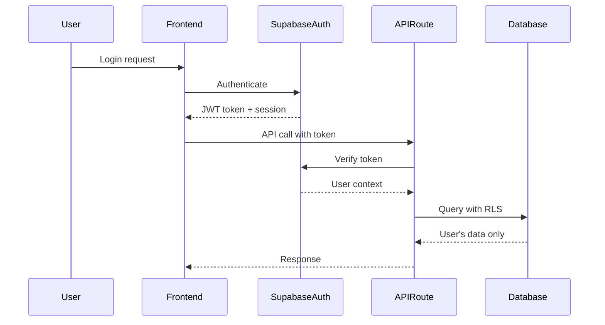

# Backend Architecture

## Service Architecture

### Serverless Architecture

**Function Organization**
```
apps/web/app/api/
├── chat/
│   ├── stream/
│   │   └── route.ts           # Claude streaming endpoint
│   ├── summarize/
│   │   └── route.ts           # Conversation summarization
│   └── search/
│       └── route.ts           # Semantic conversation search
├── workspaces/
│   └── route.ts               # Workspace CRUD operations
├── bmad/
│   ├── templates/
│   │   └── route.ts           # Template management
│   ├── analysis/
│   │   └── route.ts           # Strategic analysis engine
│   └── route.ts               # BMad session management
└── export/
    └── route.ts               # Conversation export
```

**Function Template**
```typescript
import { NextRequest, NextResponse } from 'next/server'
import { createClient } from '@/lib/supabase/server'
import { claudeClient } from '@/lib/ai/claude-client'

export async function POST(request: NextRequest) {
  try {
    // Authentication
    const supabase = await createClient()
    const { data: { user }, error: authError } = await supabase.auth.getUser()
    
    if (authError || !user) {
      return NextResponse.json(
        { error: 'Unauthorized' }, 
        { status: 401 }
      )
    }

    // Request validation
    const body = await request.json()
    // ... validation logic

    // Business logic
    const result = await processRequest(body, user.id)

    return NextResponse.json(result)
  } catch (error) {
    console.error('API Error:', error)
    return NextResponse.json(
      { error: 'Internal server error' },
      { status: 500 }
    )
  }
}
```

## Database Architecture

### Data Access Layer
```typescript
// lib/database/repositories/conversationRepository.ts
import { createClient } from '@/lib/supabase/server'
import type { Conversation, ConversationInsert } from '@/types/database'

export class ConversationRepository {
  private supabase = createClient()

  async create(conversation: ConversationInsert): Promise<Conversation> {
    const { data, error } = await this.supabase
      .from('conversations')
      .insert(conversation)
      .select()
      .single()

    if (error) throw error
    return data
  }

  async findByWorkspaceId(workspaceId: string): Promise<Conversation[]> {
    const { data, error } = await this.supabase
      .from('conversations')
      .select('*')
      .eq('workspace_id', workspaceId)
      .order('updated_at', { ascending: false })

    if (error) throw error
    return data
  }

  async updateContext(
    id: string, 
    context: Record<string, any>
  ): Promise<void> {
    const { error } = await this.supabase
      .from('conversations')
      .update({ coaching_context: context, updated_at: new Date() })
      .eq('id', id)

    if (error) throw error
  }
}
```

## Authentication and Authorization

### Auth Flow


### Middleware/Guards
```typescript
// lib/auth/middleware.ts
import { createServerClient } from '@supabase/ssr'
import { NextResponse, type NextRequest } from 'next/server'

export async function middleware(request: NextRequest) {
  let response = NextResponse.next({
    request: {
      headers: request.headers,
    },
  })

  const supabase = createServerClient(
    process.env.NEXT_PUBLIC_SUPABASE_URL!,
    process.env.NEXT_PUBLIC_SUPABASE_ANON_KEY!,
    {
      cookies: {
        get(name: string) {
          return request.cookies.get(name)?.value
        },
        set(name: string, value: string, options: any) {
          request.cookies.set({
            name,
            value,
            ...options,
          })
          response = NextResponse.next({
            request: {
              headers: request.headers,
            },
          })
          response.cookies.set({
            name,
            value,
            ...options,
          })
        },
        remove(name: string, options: any) {
          request.cookies.set({
            name,
            value: '',
            ...options,
          })
          response = NextResponse.next({
            request: {
              headers: request.headers,
            },
          })
          response.cookies.set({
            name,
            value: '',
            ...options,
          })
        },
      },
    }
  )

  const { data: { user } } = await supabase.auth.getUser()

  // Protect API routes
  if (request.nextUrl.pathname.startsWith('/api') && !user) {
    return NextResponse.json({ error: 'Unauthorized' }, { status: 401 })
  }

  return response
}

export const config = {
  matcher: [
    '/api/:path*',
    '/workspace/:path*',
    '/dashboard/:path*'
  ]
}
```
