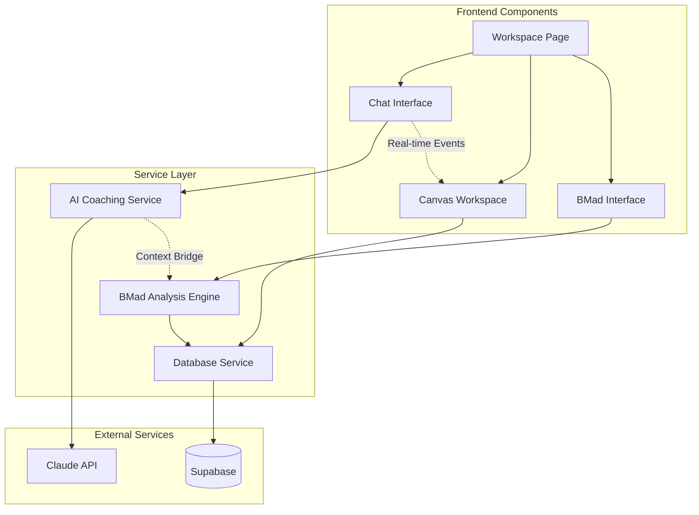

# Components

## Chat Interface Component

**Responsibility:** Real-time AI conversation interface with streaming responses and message management

**Key Interfaces:**
- ChatMessage props with SSE streaming
- ConversationHistory management with pagination
- MessageInput with validation and submission
- BookmarkSystem for message references

**Dependencies:** Claude client, Conversation persistence, State management
**Technology Stack:** React 19 with Server-Sent Events, Zustand for state, TypeScript for type safety

## Canvas Workspace Component

**Responsibility:** Visual workspace for strategic thinking with drawing tools and element persistence

**Key Interfaces:**
- CanvasElement creation and manipulation
- Drawing tool palette and controls
- Element persistence to Supabase
- Real-time collaboration support

**Dependencies:** Canvas rendering library, Workspace state, Database persistence
**Technology Stack:** HTML5 Canvas or SVG, custom drawing tools, real-time state sync

## BMad Strategic Framework Component

**Responsibility:** Structured strategic thinking templates integrated with AI coaching conversations

**Key Interfaces:**
- Template selection and customization
- Strategic analysis engine integration
- Context bridge with coaching conversation
- Document generation and export

**Dependencies:** BMad analysis engines, Template system, Chat context bridge
**Technology Stack:** React components with strategic analysis TypeScript modules

## AI Coaching Service

**Responsibility:** Claude Sonnet 4.0 integration with Mary coaching persona and context management

**Key Interfaces:**
- Streaming conversation API with SSE
- Persona context management
- Token usage tracking and optimization
- Error handling and retry logic

**Dependencies:** Anthropic SDK, Conversation persistence, Context management
**Technology Stack:** Next.js API routes, Anthropic Claude SDK, Server-Sent Events

## Database Service Layer

**Responsibility:** Supabase integration with conversation persistence, user management, and real-time features

**Key Interfaces:**
- User authentication and profile management
- Conversation CRUD with search capabilities
- Workspace state persistence
- Real-time subscription management

**Dependencies:** Supabase client, Row Level Security policies, Database schema
**Technology Stack:** Supabase SDK, PostgreSQL with RLS, TypeScript query builders

## Component Diagrams

