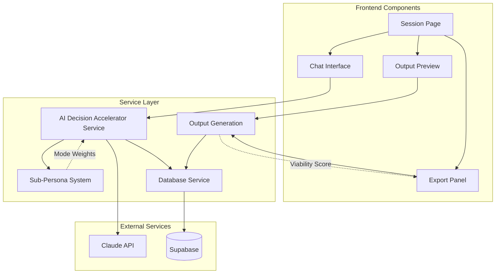

# Components

## Chat Interface Component

**Responsibility:** Real-time AI conversation interface with streaming responses, sub-persona mode display, and session progression

**Key Interfaces:**
- ChatMessage props with SSE streaming
- ConversationHistory management with pagination
- MessageInput with validation and submission
- ModeIndicator for sub-persona state (post-MVP)

**Dependencies:** Claude client, Conversation persistence, Sub-persona state
**Technology Stack:** React 19 with Server-Sent Events, TypeScript for type safety

## Output Generation Component

**Responsibility:** Generate polished Lean Canvas and PRD/Spec documents from session insights

**Key Interfaces:**
- LeanCanvasGenerator: Extract and format Lean Canvas sections
- PRDSpecGenerator: Generate detailed working documents
- ViabilityScorer: Calculate and display kill score when applicable
- ExportPanel: PDF/Markdown export controls

**Dependencies:** Conversation history, Template system, PDF generator
**Technology Stack:** React components, @react-pdf/renderer for PDF

## Sub-Persona System

**Responsibility:** Manage four sub-persona modes with pathway-specific weights and dynamic shifting

**Key Interfaces:**
- ModeWeights: {inquisitive, devilsAdvocate, encouraging, realistic}
- PathwayConfig: Default weights per pathway type
- DynamicShift: Detect user state and adjust mode
- KillFramework: Escalation sequence for kill recommendations

**Dependencies:** Claude system prompts, Session state, Pathway configuration
**Technology Stack:** TypeScript modules integrated with AI service

## AI Decision Accelerator Service

**Responsibility:** Claude integration with Mary persona, sub-persona balancing, and anti-sycophancy features

**Key Interfaces:**
- Streaming conversation API with SSE
- Sub-persona weight management
- Kill recommendation logic
- Context injection for pathway behavior

**Dependencies:** Anthropic SDK, Sub-persona system, Kill framework
**Technology Stack:** Next.js API routes, Anthropic Claude SDK, Server-Sent Events

## Canvas Workspace Component (Post-MVP)

**Responsibility:** Visual workspace for low-fi diagrams and sketches (nice-to-have, not critical)

**Key Interfaces:**
- Drawing tools for sketches
- Mermaid diagram rendering
- Export to PNG/SVG

**Dependencies:** Canvas rendering library, Database persistence
**Technology Stack:** HTML5 Canvas or Excalidraw-style rendering

## Database Service Layer

**Responsibility:** Supabase integration with conversation persistence, user management, and real-time features

**Key Interfaces:**
- User authentication and profile management
- Conversation CRUD with search capabilities
- Workspace state persistence
- Real-time subscription management

**Dependencies:** Supabase client, Row Level Security policies, Database schema
**Technology Stack:** Supabase SDK, PostgreSQL with RLS, TypeScript query builders

## Component Diagrams

