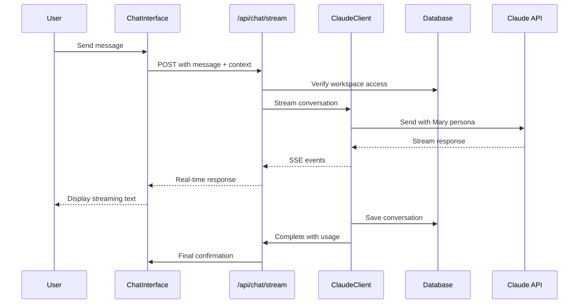
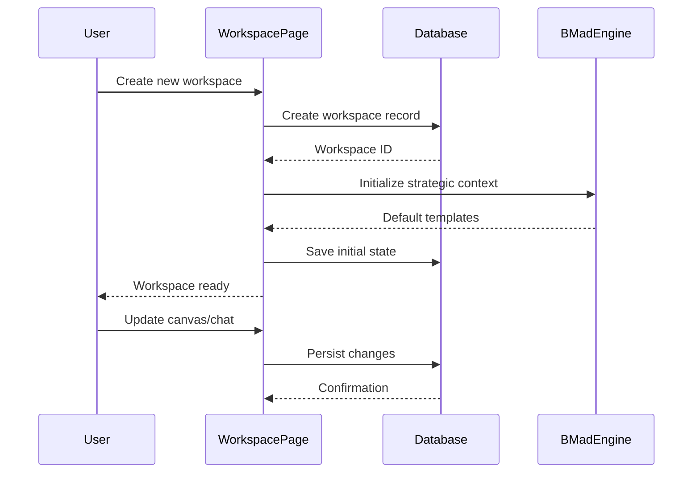

# Core Workflows

## AI Coaching Conversation Flow

```mermaid
sequenceDiagram
    participant User
    participant ChatInterface
    participant APIRoute as /api/chat/stream
    participant ClaudeClient
    participant Database
    participant Claude as Claude API
    
    User->>ChatInterface: Send message
    ChatInterface->>APIRoute: POST with message + context
    APIRoute->>Database: Verify workspace access
    APIRoute->>ClaudeClient: Stream conversation
    ClaudeClient->>Claude: Send with Mary persona
    
    Claude-->>ClaudeClient: Stream response
    ClaudeClient-->>APIRoute: SSE events
    APIRoute-->>ChatInterface: Real-time response
    ChatInterface-->>User: Display streaming text
    
    ClaudeClient->>Database: Save conversation
    ClaudeClient->>APIRoute: Complete with usage
    APIRoute->>ChatInterface: Final confirmation
```

## Workspace Creation and Management Flow

```mermaid
sequenceDiagram
    participant User
    participant WorkspacePage
    participant Database
    participant BMadEngine
    
    User->>WorkspacePage: Create new workspace
    WorkspacePage->>Database: Create workspace record
    Database-->>WorkspacePage: Workspace ID
    
    WorkspacePage->>BMadEngine: Initialize strategic context
    BMadEngine-->>WorkspacePage: Default templates
    
    WorkspacePage->>Database: Save initial state
    WorkspacePage-->>User: Workspace ready
    
    User->>WorkspacePage: Update canvas/chat
    WorkspacePage->>Database: Persist changes
    Database-->>WorkspacePage: Confirmation
```
