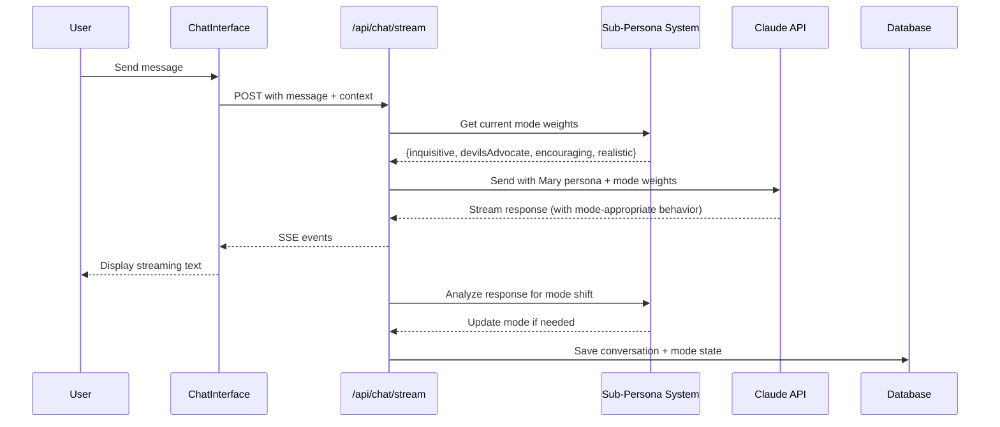
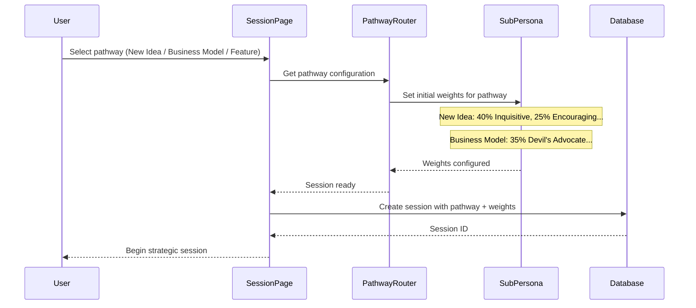
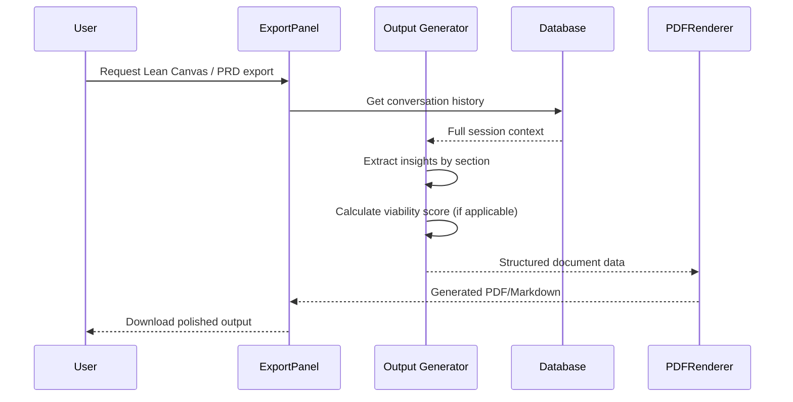

# Core Workflows

## AI Decision Accelerator Conversation Flow

```mermaid
sequenceDiagram
    participant User
    participant ChatInterface
    participant APIRoute as /api/chat/stream
    participant SubPersona as Sub-Persona System
    participant Claude as Claude API
    participant Database

    User->>ChatInterface: Send message
    ChatInterface->>APIRoute: POST with message + context

    APIRoute->>SubPersona: Get current mode weights
    SubPersona-->>APIRoute: {inquisitive, devilsAdvocate, encouraging, realistic}

    APIRoute->>Claude: Send with Mary persona + mode weights
    Claude-->>APIRoute: Stream response (with mode-appropriate behavior)

    APIRoute-->>ChatInterface: SSE events
    ChatInterface-->>User: Display streaming text

    APIRoute->>SubPersona: Analyze response for mode shift
    SubPersona-->>APIRoute: Update mode if needed

    APIRoute->>Database: Save conversation + mode state
```

## Session Creation with Pathway Weights

```mermaid
sequenceDiagram
    participant User
    participant SessionPage
    participant PathwayRouter
    participant SubPersona
    participant Database

    User->>SessionPage: Select pathway (New Idea / Business Model / Feature)
    SessionPage->>PathwayRouter: Get pathway configuration

    PathwayRouter->>SubPersona: Set initial weights for pathway
    Note over SubPersona: New Idea: 40% Inquisitive, 25% Encouraging...
    Note over SubPersona: Business Model: 35% Devil's Advocate...

    SubPersona-->>PathwayRouter: Weights configured
    PathwayRouter-->>SessionPage: Session ready

    SessionPage->>Database: Create session with pathway + weights
    Database-->>SessionPage: Session ID

    SessionPage-->>User: Begin strategic session
```

## Output Generation Flow

```mermaid
sequenceDiagram
    participant User
    participant ExportPanel
    participant OutputGen as Output Generator
    participant Database
    participant PDFRenderer

    User->>ExportPanel: Request Lean Canvas / PRD export
    ExportPanel->>Database: Get conversation history

    Database-->>OutputGen: Full session context
    OutputGen->>OutputGen: Extract insights by section
    OutputGen->>OutputGen: Calculate viability score (if applicable)

    OutputGen-->>PDFRenderer: Structured document data
    PDFRenderer-->>ExportPanel: Generated PDF/Markdown

    ExportPanel-->>User: Download polished output
```
