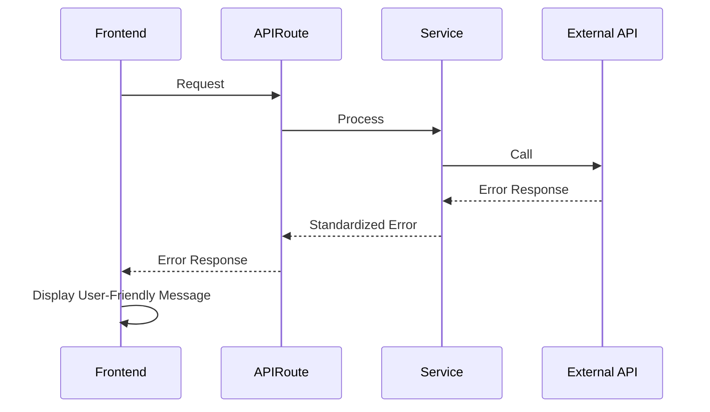

# Error Handling Strategy

## Error Flow



## Error Response Format

```typescript
interface ApiError {
  error: {
    code: string;
    message: string;
    details?: Record<string, any>;
    timestamp: string;
    requestId: string;
  };
}

// Standard error codes
enum ErrorCodes {
  UNAUTHORIZED = 'UNAUTHORIZED',
  FORBIDDEN = 'FORBIDDEN',
  VALIDATION_ERROR = 'VALIDATION_ERROR',
  AI_SERVICE_ERROR = 'AI_SERVICE_ERROR',
  DATABASE_ERROR = 'DATABASE_ERROR',
  RATE_LIMIT_EXCEEDED = 'RATE_LIMIT_EXCEEDED'
}
```

## Frontend Error Handling

```typescript
// lib/errors/errorHandler.ts
export class ErrorHandler {
  static handle(error: any, context: string = 'Unknown') {
    console.error(`Error in ${context}:`, error)
    
    if (error.response?.data?.error) {
      const apiError = error.response.data.error
      return {
        message: apiError.message,
        code: apiError.code,
        userMessage: this.getUserFriendlyMessage(apiError.code)
      }
    }
    
    return {
      message: error.message || 'Unknown error',
      code: 'UNKNOWN_ERROR',
      userMessage: 'Something went wrong. Please try again.'
    }
  }
  
  private static getUserFriendlyMessage(code: string): string {
    const messages = {
      'AI_SERVICE_ERROR': 'AI service is temporarily unavailable. Please try again.',
      'RATE_LIMIT_EXCEEDED': 'Too many requests. Please wait a moment and try again.',
      'VALIDATION_ERROR': 'Please check your input and try again.'
    }
    return messages[code] || 'Something went wrong. Please try again.'
  }
}
```

## Backend Error Handling

```typescript
// lib/errors/apiErrorHandler.ts
export function handleApiError(error: any, context: string): NextResponse {
  const requestId = crypto.randomUUID()
  const timestamp = new Date().toISOString()
  
  console.error(`API Error [${requestId}] in ${context}:`, error)
  
  // Anthropic API errors
  if (error.status === 429) {
    return NextResponse.json({
      error: {
        code: 'RATE_LIMIT_EXCEEDED',
        message: 'AI service rate limit exceeded',
        requestId,
        timestamp
      }
    }, { status: 429 })
  }
  
  // Supabase errors
  if (error.code === 'PGRST116') {
    return NextResponse.json({
      error: {
        code: 'FORBIDDEN',
        message: 'Access denied to requested resource',
        requestId,
        timestamp
      }
    }, { status: 403 })
  }
  
  // Generic server error
  return NextResponse.json({
    error: {
      code: 'INTERNAL_SERVER_ERROR',
      message: 'An unexpected error occurred',
      requestId,
      timestamp
    }
  }, { status: 500 })
}
```
