# High Level Architecture

## Technical Summary

ThinkHaven implements a **modern serverless-first architecture** with a conversation-first user interface for AI-powered decision acceleration. The architecture leverages Next.js 15's App Router for both frontend and API layers, integrating with Supabase for data persistence, and Anthropic Claude for AI capabilities with sub-persona balancing. The system follows a **component-based frontend architecture** with **API-first backend design**, enabling seamless AI conversation streaming with enforced methodology, anti-sycophancy features, and polished output generation (Lean Canvas, PRD/Spec).

## Platform and Infrastructure Choice

**Platform:** Vercel + Supabase
**Key Services:** Vercel Edge Functions, Supabase Database/Auth/Storage, Anthropic Claude API
**Deployment Host and Regions:** Global CDN with edge compute, multi-region database replication

**Rationale:** This combination provides optimal developer experience, automatic scaling, and integrated auth/database/real-time features perfect for AI-powered applications.

## Repository Structure

**Structure:** Monorepo with npm workspaces
**Monorepo Tool:** npm workspaces (built-in)
**Package Organization:** Apps (web), Packages (shared utilities), Framework definitions (.bmad-core)

## High Level Architecture Diagram

```mermaid
graph TB
    User[👤 User] --> Web[Next.js Web App]
    Web --> Auth[Supabase Auth]
    Web --> API[Next.js API Routes]

    API --> Claude[Anthropic Claude API]
    API --> DB[(Supabase Database)]

    subgraph "Frontend Components"
        Web --> Chat[Chat Interface]
        Web --> Output[Output Preview]
        Web --> Export[Export Panel]
    end

    subgraph "AI Integration Layer"
        Claude --> Persona[Mary Persona + Sub-Personas]
        Claude --> Stream[Server-Sent Events]
        Persona --> Modes[Inquisitive / Devil's Advocate / Encouraging / Realistic]
    end

    subgraph "Output Generation"
        API --> LeanCanvas[Lean Canvas Generator]
        API --> PRDSpec[PRD/Spec Generator]
        API --> ViabilityScore[Viability Scoring]
    end

    subgraph "Data Layer"
        DB --> Sessions[Sessions]
        DB --> Conversations[Conversations]
        DB --> Credits[Credit System]
    end

    Web --> CDN[Vercel CDN/Edge]
```

## Architectural Patterns

- **Jamstack Architecture:** Static generation with serverless APIs - _Rationale:_ Optimal performance and global distribution for AI chat applications
- **Component-Based UI:** Reusable React components with TypeScript - _Rationale:_ Maintainability and type safety across dual-pane interface
- **API-First Backend:** RESTful endpoints with streaming support - _Rationale:_ Enables real-time AI conversation while maintaining clean separation
- **Event-Driven Architecture:** Server-Sent Events for real-time updates - _Rationale:_ Superior to WebSockets for AI streaming with built-in reconnection
- **Domain-Driven Design:** Clear separation between AI, BMad, and Workspace domains - _Rationale:_ Supports complex strategic coaching workflows
