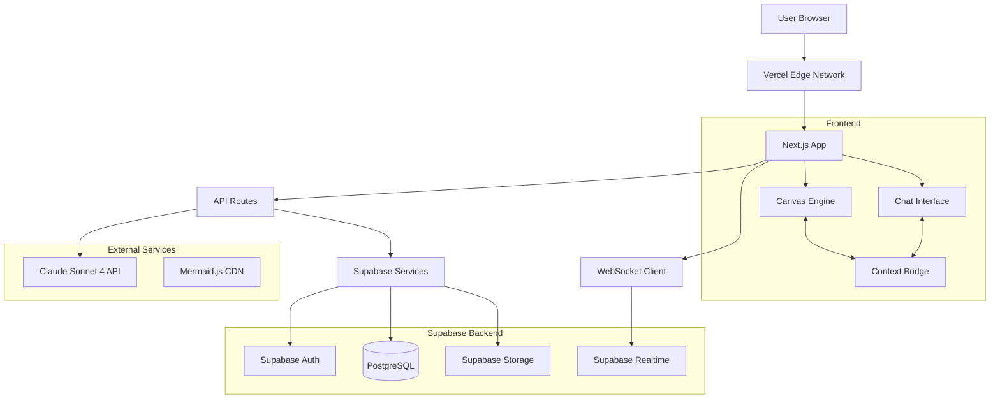
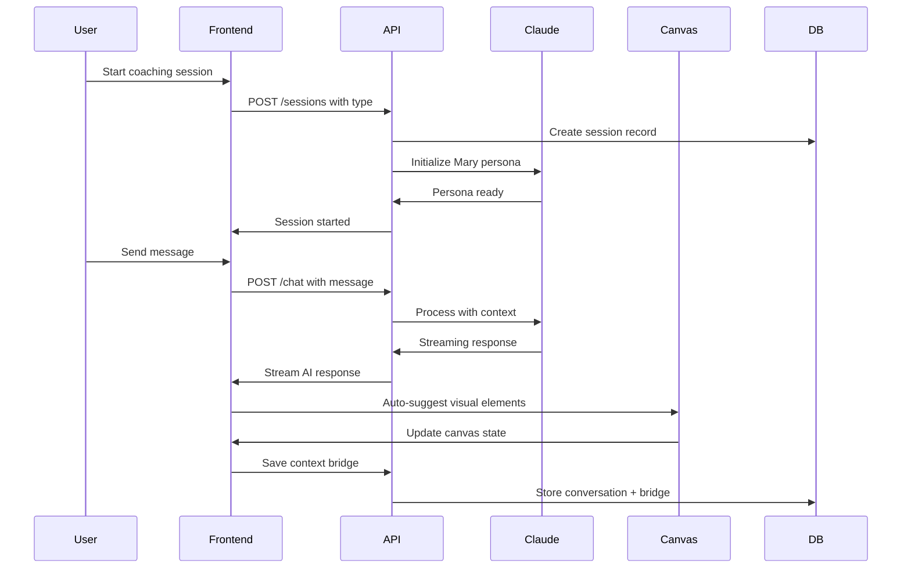
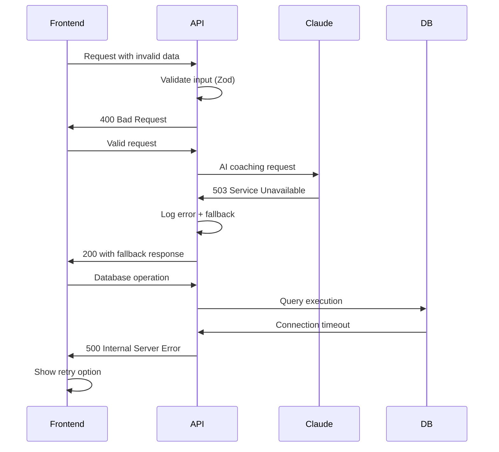

# bMAD Method Analyst Web Platform - Fullstack Architecture Document

## Introduction

This document outlines the complete fullstack architecture for **bMAD Method Analyst Web Platform**, including backend systems, frontend implementation, and their integration. It serves as the single source of truth for AI-driven development, ensuring consistency across the entire technology stack.

This unified approach combines what would traditionally be separate backend and frontend architecture documents, streamlining the development process for modern fullstack applications where these concerns are increasingly intertwined.

### Starter Template or Existing Project

**Status:** Greenfield project with specific technical preferences defined in PRD

The project specifies:

- **Next.js 14+** with App Router as frontend framework
- **Supabase** for backend services (auth, database, storage)
- **Claude Sonnet 4 API** for AI coaching integration
- **Vercel** for deployment
- **TypeScript** throughout the stack
- **Tailwind CSS** for styling

No existing starter template mentioned, but the tech stack is well-defined for a modern serverless full-stack application.

### Change Log

| Date | Version | Description | Author |
|------|---------|-------------|--------|
| 2024-12-24 | 1.0 | Initial bMAD Method platform architecture | Winston (Architect) |

## High Level Architecture

### Technical Summary

The bMAD Method Analyst Web Platform employs a **serverless-first architecture** with Next.js 14+ frontend deployed on Vercel, Supabase backend services, and Claude Sonnet 4 API integration for AI coaching. The system features a sophisticated **dual-pane interface** with real-time synchronization between conversational coaching and visual canvas elements, supported by a custom **YAML template engine** for extensible coaching patterns. **WebSocket connections** enable real-time collaboration and context bridging, while **PostgreSQL** stores session state, user workspaces, and visual artifacts with **Supabase Storage** handling file exports and canvas snapshots.

### Platform and Infrastructure Choice

**Platform:** Vercel + Supabase Serverless Stack

**Key Services:**

- Vercel (Frontend hosting, API routes, Edge functions)
- Supabase (PostgreSQL database, Authentication, File storage, Realtime subscriptions)
- Claude Sonnet 4 API (AI coaching engine)
- Mermaid.js CDN (Diagram rendering)

**Deployment Host and Regions:** Vercel Edge Network (global), Supabase US East + EU West for compliance

### Repository Structure

**Structure:** Monorepo with feature-based organization

**Monorepo Tool:** npm workspaces (lightweight, built-in)

**Package Organization:**

- `/apps/web` - Next.js frontend application
- `/packages/shared` - TypeScript interfaces and utilities
- `/packages/bmad-engine` - YAML template parser and coaching logic
- `/packages/ui` - Reusable UI components with dual-pane primitives

### High Level Architecture Diagram



### Architectural Patterns

- **Jamstack Architecture:** Static generation with serverless APIs - *Rationale:* Optimal performance for global CDN distribution while supporting dynamic coaching interactions
- **Component-Based UI:** React components with TypeScript and dual-pane primitives - *Rationale:* Reusable chat and canvas components with strongly-typed props for coaching patterns
- **Template-Driven Workflows:** YAML configuration driving AI coaching flows - *Rationale:* Enables community contributions and rapid iteration without code changes
- **Real-time Synchronization:** WebSocket state sharing between chat and canvas - *Rationale:* Essential for context bridging and collaborative workspace features
- **Serverless Functions:** Vercel Edge Functions for AI API integration - *Rationale:* Auto-scaling with global edge deployment for low-latency coaching responses
- **Event-Driven Architecture:** Supabase triggers for session state management - *Rationale:* Maintains consistency across dual-pane interactions and supports audit trails

## Tech Stack

### Technology Stack Table

| Category | Technology | Version | Purpose | Rationale |
|----------|------------|---------|---------|-----------|
| Frontend Language | TypeScript | ^5.3.0 | Type-safe development across dual-pane interface | Essential for complex state management between chat/canvas components and YAML template typing |
| Frontend Framework | Next.js | ^14.1.0 | React framework with App Router | App Router ideal for dual-pane routing, built-in API routes for Claude integration, Vercel optimization |
| UI Component Library | Tailwind CSS + Headless UI | ^3.4.0 + ^1.7.0 | Utility-first styling with accessible components | Rapid prototyping of dual-pane layouts, accessibility compliance, design system consistency |
| State Management | Zustand + SWR | ^4.4.0 + ^2.2.0 | Client state + server state management | Zustand for dual-pane synchronization, SWR for coaching template caching and real-time updates |
| Backend Language | TypeScript | ^5.3.0 | Server-side logic in API routes | Shared types between frontend/backend, especially for YAML template definitions and AI responses |
| Backend Framework | Next.js API Routes | ^14.1.0 | Serverless API endpoints | Integrated with frontend, auto-deployed to Vercel Edge, supports streaming for AI responses |
| API Style | REST + WebSocket | HTTP/1.1 + WSS | RESTful APIs + real-time communication | REST for coaching operations, WebSocket for dual-pane context bridging and collaboration |
| Database | PostgreSQL (Supabase) | ^15.0 | Relational database with real-time features | JSONB support for flexible coaching session data, built-in real-time subscriptions, Row Level Security |
| Cache | Vercel Edge Cache + SWR | Native + ^2.2.0 | CDN caching + client-side cache | Coaching template caching, AI response optimization, reduced Claude API calls |
| File Storage | Supabase Storage | Latest | Canvas exports, session documents | S3-compatible with CDN, automatic image optimization, integrated with auth system |
| Authentication | Supabase Auth | Latest | User management and session security | OAuth providers, email/password, JWT tokens, Row Level Security integration |
| Frontend Testing | Vitest + Testing Library | ^1.2.0 + ^14.0.0 | Unit and integration testing | Fast test runner, React component testing, dual-pane interaction testing |
| Backend Testing | Vitest + Supertest | ^1.2.0 + ^6.3.0 | API endpoint testing | Consistent test runner, HTTP assertion testing for coaching API endpoints |
| E2E Testing | Playwright | ^1.40.0 | End-to-end workflow testing | Cross-browser testing of coaching sessions, dual-pane interactions, visual regression |
| Build Tool | Turbo | ^1.11.0 | Monorepo build orchestration | Parallel builds, intelligent caching, optimized for shared TypeScript interfaces |
| Bundler | Next.js (Turbopack) | ^14.1.0 | Module bundling and optimization | Built-in optimization, code splitting for coaching patterns, tree shaking |
| IaC Tool | Vercel CLI + Supabase CLI | Latest | Infrastructure as code | Environment management, preview deployments, database migrations |
| CI/CD | GitHub Actions | Latest | Automated testing and deployment | Integration with Vercel, type checking, test automation, coaching pattern validation |
| Monitoring | Vercel Analytics + Sentry | Latest + ^7.99.0 | Performance and error tracking | Real User Monitoring, error tracking for AI interactions, coaching session analytics |
| Logging | Vercel Functions Logs + Axiom | Native + Latest | Centralized logging | Structured logging for coaching sessions, AI API call tracing, debugging dual-pane issues |
| CSS Framework | Tailwind CSS | ^3.4.0 | Utility-first styling | Rapid dual-pane layout development, consistent design system, responsive coaching interface |

## Data Models

### User

**Purpose:** Core user account with authentication and workspace management for strategic thinking sessions

#### TypeScript Interface

```typescript
interface User {
  id: string;
  email: string;
  profile: UserProfile | null;
  created_at: string;
  updated_at: string;
}

interface UserProfile {
  display_name: string;
  avatar_url?: string;
  coaching_preferences: {
    preferred_techniques: string[];
    session_duration_preference: number;
    visual_vs_conversational_preference: 'visual' | 'conversational' | 'balanced';
  };
  professional_context: {
    role?: string;
    industry?: string;
    experience_level: 'beginner' | 'intermediate' | 'expert';
  };
}
```

#### User Relationships

- One-to-many with StrategicWorkspace (user creates workspaces)
- One-to-many with CoachingSession (user participates in sessions)
- Many-to-many with StrategicWorkspace through WorkspaceCollaborator (shared workspaces)

### StrategicWorkspace

**Purpose:** Container for strategic thinking projects with persistent dual-pane state and collaboration features

#### TypeScript Interface

```typescript
interface StrategicWorkspace {
  id: string;
  owner_id: string;
  title: string;
  description: string;
  workspace_state: WorkspaceState;
  collaboration_settings: CollaborationConfig;
  created_at: string;
  updated_at: string;
}

interface WorkspaceState {
  chat_context: {
    current_persona: 'mary' | 'strategic_advisor' | 'innovation_coach';
    conversation_phase: 'exploration' | 'validation' | 'planning';
    session_progress: number; // 0-100
  };
  canvas_state: {
    elements: CanvasElement[];
    viewport: { x: number; y: number; zoom: number };
    active_tool: string;
  };
  context_bridges: ContextBridge[];
}
```

#### StrategicWorkspace Relationships

- Belongs to User (owner)
- One-to-many with CoachingSession (sessions within workspace)
- One-to-many with CanvasArtifact (visual elements)
- One-to-many with WorkspaceCollaborator (team access)

### CoachingSession

**Purpose:** Individual coaching interaction with AI persona, capturing conversation flow and coaching pattern execution

#### TypeScript Interface

```typescript
interface CoachingSession {
  id: string;
  workspace_id: string;
  user_id: string;
  session_type: 'new_idea' | 'business_model_problem' | 'feature_refinement' | 'custom';
  coaching_pattern_id: string;
  ai_persona_evolution: PersonaEvolution[];
  conversation_transcript: ConversationMessage[];
  session_outcomes: SessionOutcome;
  started_at: string;
  completed_at: string | null;
  duration_minutes: number;
}

interface ConversationMessage {
  id: string;
  role: 'user' | 'assistant';
  content: string;
  timestamp: string;
  persona: string;
  coaching_technique_used?: string;
  context_bridge_refs?: string[]; // References to canvas elements
}
```

#### CoachingSession Relationships

- Belongs to StrategicWorkspace
- Belongs to User
- References CoachingPattern (YAML template)
- One-to-many with ContextBridge (chat-canvas connections)

### CanvasArtifact

**Purpose:** Visual elements created in canvas pane including wireframes, Mermaid diagrams, and annotations with version history

#### TypeScript Interface

```typescript
interface CanvasArtifact {
  id: string;
  workspace_id: string;
  artifact_type: 'wireframe' | 'mermaid_diagram' | 'mind_map' | 'annotation' | 'sketch';
  content_data: Record<string, any>;
  mermaid_source?: string;
  position: {
    x: number;
    y: number;
    width: number;
    height: number;
    z_index: number;
  };
  styling: {
    color: string;
    stroke_width: number;
    font_size?: number;
    opacity: number;
  };
  version_history: ArtifactVersion[];
  created_at: string;
  updated_at: string;
}
```

#### CanvasArtifact Relationships

- Belongs to StrategicWorkspace
- One-to-many with ContextBridge (connected to chat messages)
- References User through change history

### CoachingPattern

**Purpose:** YAML-driven coaching templates from bMAD Method and community contributions, defining structured coaching workflows

#### TypeScript Interface

```typescript
interface CoachingPattern {
  id: string;
  name: string;
  description: string;
  category: 'bmad_core' | 'design_thinking' | 'lean_startup' | 'jobs_to_be_done' | 'custom';
  yaml_definition: string;
  community_metadata: CommunityMetadata;
  usage_analytics: {
    times_used: number;
    average_rating: number;
    completion_rate: number;
    average_duration_minutes: number;
  };
  created_at: string;
  updated_at: string;
}
```

#### CoachingPattern Relationships

- Belongs to User (author)
- One-to-many with CoachingSession (pattern usage)
- Many-to-many with CoachingPattern (pattern inheritance/forking)

### ContextBridge

**Purpose:** Links between chat conversations and canvas elements, enabling semantic connections between verbal insights and visual representations

#### TypeScript Interface

```typescript
interface ContextBridge {
  id: string;
  workspace_id: string;
  conversation_message_id: string;
  canvas_artifact_id: string;
  bridge_type: 'auto_generated' | 'user_created' | 'ai_suggested';
  semantic_connection: {
    connection_type: 'illustrates' | 'challenges' | 'elaborates' | 'contradicts' | 'implements';
    relevance_explanation: string;
    confidence_score: number; // 0-1
  };
  user_validated: boolean;
  created_at: string;
  validated_at: string | null;
}
```

#### ContextBridge Relationships

- References ConversationMessage
- References CanvasArtifact
- Belongs to StrategicWorkspace

## API Specification

### REST API Specification

```yaml
openapi: 3.0.0
info:
  title: bMAD Method Analyst Web Platform API
  version: 1.0.0
  description: RESTful API for strategic thinking workspace with dual-pane coaching interface
servers:
  - url: https://thinkhaven/api
    description: Production API server

paths:
  /workspaces:
    get:
      summary: List user's strategic workspaces
      responses:
        '200':
          description: List of workspaces
    post:
      summary: Create new strategic workspace
      responses:
        '201':
          description: Workspace created successfully

  /workspaces/{workspace_id}/sessions:
    post:
      summary: Start new coaching session
      responses:
        '201':
          description: Coaching session started

  /sessions/{session_id}/chat:
    post:
      summary: Send message to AI coaching persona
      responses:
        '200':
          description: AI response stream
          content:
            text/event-stream:
              schema:
                type: object

  /workspaces/{workspace_id}/canvas:
    get:
      summary: Get canvas artifacts for workspace
      responses:
        '200':
          description: Canvas artifacts
    post:
      summary: Create new canvas artifact
      responses:
        '201':
          description: Canvas artifact created

  /coaching-patterns:
    get:
      summary: List available coaching patterns
      responses:
        '200':
          description: Available coaching patterns

  /workspaces/{workspace_id}/export:
    post:
      summary: Generate integrated document export
      responses:
        '202':
          description: Export job started
```

## Components

### Frontend Application (Next.js)

**Responsibility:** Primary user interface providing dual-pane strategic thinking workspace with real-time coaching interactions

**Key Interfaces:**

- React components for chat and canvas panes with shared state management
- WebSocket client for real-time collaboration and context bridging
- Service layer abstraction for API communications and caching

**Dependencies:** Supabase client, Canvas Engine, bMAD Engine, UI component library

**Technology Stack:** Next.js 14 App Router, TypeScript, Tailwind CSS, Zustand state management, SWR data fetching

### API Gateway (Next.js API Routes)

**Responsibility:** Serverless API layer handling authentication, AI integration, and business logic orchestration

**Key Interfaces:**

- RESTful endpoints for workspace and session management
- Server-Sent Events for streaming AI responses
- WebSocket handlers for real-time dual-pane synchronization

**Dependencies:** Claude Sonnet 4 API, Supabase services, YAML template parser

**Technology Stack:** Next.js API routes, Vercel Edge Functions, TypeScript, Supabase client libraries

### bMAD Engine (Package)

**Responsibility:** YAML template parsing, coaching pattern execution, and AI persona management with community extensibility

**Key Interfaces:**

- Template validation and execution engine
- Persona evolution logic with transparent state transitions
- Community pattern loader with GitHub-style contribution workflow

**Dependencies:** YAML parser, template validation schemas, AI prompt engineering utilities

**Technology Stack:** TypeScript, YAML parsing library, validation schemas, prompt template system

### Canvas Engine (Package)

**Responsibility:** Interactive visual workspace with HTML5 Canvas, Mermaid integration, and real-time collaboration support

**Key Interfaces:**

- Canvas rendering engine with infinite scroll and zoom
- Mermaid diagram integration with live editing
- Context bridge API linking visual elements to conversation

**Dependencies:** HTML5 Canvas API, Mermaid.js, collaboration sync protocols

**Technology Stack:** TypeScript, HTML5 Canvas, Mermaid.js, conflict resolution algorithms

### Context Bridge Service

**Responsibility:** Intelligent connection system linking conversational insights with visual elements using semantic analysis

**Key Interfaces:**

- Real-time semantic analysis of chat messages and canvas changes
- Bidirectional suggestion engine for cross-pane connections
- Confidence scoring and user validation workflow

**Dependencies:** AI analysis capabilities, vector embeddings, user feedback loop

**Technology Stack:** TypeScript, semantic analysis libraries, real-time event processing

## External APIs

### Claude Sonnet 4 API

- **Purpose:** Primary AI coaching engine powering Mary persona and adaptive coaching interactions
- **Documentation:** <https://docs.anthropic.com/claude/reference>
- **Base URL(s):** <https://api.anthropic.com/v1>
- **Authentication:** API key authentication with bearer token
- **Rate Limits:** 4,000 requests/min, 400,000 tokens/min

**Key Endpoints Used:**

- `POST /messages` - Streaming chat completions for coaching conversations
- `POST /messages/stream` - Server-sent events for real-time coaching responses

### Supabase APIs

- **Purpose:** Backend-as-a-Service providing authentication, database, storage, and real-time subscriptions
- **Documentation:** <https://supabase.com/docs/reference>
- **Base URL(s):** <https://[project-ref].supabase.co/rest/v1>
- **Authentication:** JWT tokens from Supabase Auth, API keys for service role
- **Rate Limits:** 500 requests/second per project

**Key Endpoints Used:**

- `POST /auth/v1/token` - User authentication and token refresh
- `GET/POST/PATCH /rest/v1/*` - Database operations via auto-generated REST API
- `WebSocket /realtime/v1` - Real-time subscriptions for collaboration features
- `POST /storage/v1/upload` - File uploads for canvas exports

### Mermaid.js CDN

- **Purpose:** Client-side diagram rendering for flowcharts, decision trees, and process visualization
- **Documentation:** <https://mermaid.js.org/intro/>
- **Base URL(s):** <https://cdn.jsdelivr.net/npm/mermaid/>
- **Authentication:** None (public CDN)
- **Rate Limits:** CDN bandwidth limits

## Core Workflows



## Database Schema

```sql
-- Core user authentication table
CREATE TABLE users (
    id UUID PRIMARY KEY DEFAULT gen_random_uuid(),
    email TEXT UNIQUE NOT NULL,
    profile JSONB,
    created_at TIMESTAMPTZ DEFAULT NOW(),
    updated_at TIMESTAMPTZ DEFAULT NOW()
);

-- Strategic thinking workspaces
CREATE TABLE strategic_workspaces (
    id UUID PRIMARY KEY DEFAULT gen_random_uuid(),
    owner_id UUID REFERENCES users(id) ON DELETE CASCADE,
    title TEXT NOT NULL,
    description TEXT,
    workspace_state JSONB NOT NULL DEFAULT '{}',
    collaboration_settings JSONB NOT NULL DEFAULT '{}',
    created_at TIMESTAMPTZ DEFAULT NOW(),
    updated_at TIMESTAMPTZ DEFAULT NOW()
);

-- Coaching sessions within workspaces
CREATE TABLE coaching_sessions (
    id UUID PRIMARY KEY DEFAULT gen_random_uuid(),
    workspace_id UUID REFERENCES strategic_workspaces(id) ON DELETE CASCADE,
    user_id UUID REFERENCES users(id) ON DELETE CASCADE,
    session_type TEXT NOT NULL,
    coaching_pattern_id TEXT NOT NULL,
    conversation_transcript JSONB NOT NULL DEFAULT '[]',
    ai_persona_evolution JSONB NOT NULL DEFAULT '[]',
    session_outcomes JSONB,
    started_at TIMESTAMPTZ DEFAULT NOW(),
    completed_at TIMESTAMPTZ,
    duration_minutes INTEGER
);

-- Visual canvas artifacts
CREATE TABLE canvas_artifacts (
    id UUID PRIMARY KEY DEFAULT gen_random_uuid(),
    workspace_id UUID REFERENCES strategic_workspaces(id) ON DELETE CASCADE,
    artifact_type TEXT NOT NULL,
    content_data JSONB NOT NULL,
    mermaid_source TEXT,
    position JSONB NOT NULL,
    styling JSONB NOT NULL DEFAULT '{}',
    version_history JSONB NOT NULL DEFAULT '[]',
    created_at TIMESTAMPTZ DEFAULT NOW(),
    updated_at TIMESTAMPTZ DEFAULT NOW()
);

-- YAML coaching patterns
CREATE TABLE coaching_patterns (
    id TEXT PRIMARY KEY,
    name TEXT NOT NULL,
    description TEXT,
    category TEXT NOT NULL,
    yaml_definition TEXT NOT NULL,
    community_metadata JSONB NOT NULL DEFAULT '{}',
    usage_analytics JSONB NOT NULL DEFAULT '{}',
    created_at TIMESTAMPTZ DEFAULT NOW(),
    updated_at TIMESTAMPTZ DEFAULT NOW()
);

-- Links between chat and canvas
CREATE TABLE context_bridges (
    id UUID PRIMARY KEY DEFAULT gen_random_uuid(),
    workspace_id UUID REFERENCES strategic_workspaces(id) ON DELETE CASCADE,
    conversation_message_id UUID NOT NULL,
    canvas_artifact_id UUID REFERENCES canvas_artifacts(id) ON DELETE CASCADE,
    bridge_type TEXT NOT NULL,
    semantic_connection JSONB NOT NULL,
    user_validated BOOLEAN DEFAULT FALSE,
    created_at TIMESTAMPTZ DEFAULT NOW(),
    validated_at TIMESTAMPTZ
);

-- Row Level Security policies
ALTER TABLE strategic_workspaces ENABLE ROW LEVEL SECURITY;
ALTER TABLE coaching_sessions ENABLE ROW LEVEL SECURITY;
ALTER TABLE canvas_artifacts ENABLE ROW LEVEL SECURITY;

-- Users can only access their own workspaces
CREATE POLICY "Users can view own workspaces" ON strategic_workspaces
    FOR ALL USING (owner_id = auth.uid());

-- Users can only access sessions in their workspaces
CREATE POLICY "Users can view own sessions" ON coaching_sessions
    FOR ALL USING (
        workspace_id IN (
            SELECT id FROM strategic_workspaces WHERE owner_id = auth.uid()
        )
    );
```

## Unified Project Structure

```text
thinkhaven/
├── .github/                    # CI/CD workflows
│   └── workflows/
│       ├── ci.yaml
│       └── deploy.yaml
├── apps/                       # Application packages
│   ├── web/                    # Frontend application
│   │   ├── src/
│   │   │   ├── components/     # UI components
│   │   │   ├── app/            # Next.js App Router pages
│   │   │   ├── hooks/          # Custom React hooks
│   │   │   ├── services/       # API client services
│   │   │   ├── stores/         # Zustand state management
│   │   │   ├── styles/         # Global styles/themes
│   │   │   └── utils/          # Frontend utilities
│   │   ├── public/             # Static assets
│   │   ├── tests/              # Frontend tests
│   │   └── package.json
│   └── api/                    # Backend API routes (Next.js)
├── packages/                   # Shared packages
│   ├── shared/                 # Shared types/utilities
│   │   ├── src/
│   │   │   ├── types/          # TypeScript interfaces
│   │   │   ├── constants/      # Shared constants
│   │   │   └── utils/          # Shared utilities
│   │   └── package.json
│   ├── bmad-engine/            # YAML template engine
│   │   ├── src/
│   │   └── package.json
│   ├── canvas-engine/          # Canvas rendering engine
│   │   ├── src/
│   │   └── package.json
│   ├── ui/                     # Shared UI components
│   │   ├── src/
│   │   └── package.json
│   └── config/                 # Shared configuration
│       ├── eslint/
│       ├── typescript/
│       └── tailwind/
├── supabase/                   # Database migrations and config
│   ├── migrations/
│   └── config.toml
├── scripts/                    # Build/deploy scripts
├── docs/                       # Documentation
│   ├── prd-bmad.md
│   ├── landing-page.md
│   ├── pitch-deck.md
│   └── architecture.md
├── .env.example                # Environment template
├── package.json                # Root package.json
├── turbo.json                  # Turbo configuration
└── README.md
```

## Development Workflow

### Local Development Setup

#### Prerequisites

```bash
# Required software
node --version  # v18+
npm --version   # v9+
git --version   # v2.34+
```

#### Initial Setup

```bash
# Clone and install dependencies
git clone https://github.com/thinkhaven/platform.git
cd platform
npm install

# Set up Supabase
npx supabase init
npx supabase start
npx supabase db reset

# Configure environment
cp .env.example .env.local
# Edit .env.local with Claude API key and Supabase config
```

#### Development Commands

```bash
# Start all services
npm run dev

# Start frontend only
npm run dev:web

# Start backend only (if separate)
npm run dev:api

# Run tests
npm run test
npm run test:e2e
```

### Environment Configuration

#### Required Environment Variables

```bash
# Frontend (.env.local)
NEXT_PUBLIC_SUPABASE_URL=your_supabase_url
NEXT_PUBLIC_SUPABASE_ANON_KEY=your_supabase_anon_key

# Backend (.env)
SUPABASE_SERVICE_ROLE_KEY=your_service_role_key
CLAUDE_API_KEY=your_claude_api_key
NEXTAUTH_SECRET=your_nextauth_secret

# Shared
DATABASE_URL=postgresql://...
```

## Deployment Architecture

### Deployment Strategy

**Frontend Deployment:**

- **Platform:** Vercel
- **Build Command:** `npm run build`
- **Output Directory:** `.next`
- **CDN/Edge:** Vercel Edge Network with global distribution

**Backend Deployment:**

- **Platform:** Vercel Edge Functions
- **Build Command:** Automatic via Next.js API routes
- **Deployment Method:** Git-based with automatic deployments

### CI/CD Pipeline

```yaml
name: CI/CD Pipeline
on:
  push:
    branches: [main, staging]
  pull_request:
    branches: [main]

jobs:
  test:
    runs-on: ubuntu-latest
    steps:
      - uses: actions/checkout@v3
      - uses: actions/setup-node@v3
        with:
          node-version: '18'
      - run: npm ci
      - run: npm run lint
      - run: npm run type-check
      - run: npm run test
      - run: npm run test:e2e

  deploy:
    if: github.ref == 'refs/heads/main'
    needs: test
    runs-on: ubuntu-latest
    steps:
      - uses: actions/checkout@v3
      - uses: vercel/action@v1
        with:
          vercel-token: ${{ secrets.VERCEL_TOKEN }}
          vercel-args: '--prod'
```

### Environments

| Environment | Frontend URL | Backend URL | Purpose |
|-------------|-------------|-------------|---------|
| Development | localhost:3000 | localhost:3000/api | Local development |
| Staging | staging.thinkhaven | staging.thinkhaven/api | Pre-production testing |
| Production | thinkhaven | thinkhaven/api | Live environment |

## Security and Performance

### Security Requirements

**Frontend Security:**

- CSP Headers: script-src 'self' 'unsafe-inline' cdn.jsdelivr.net; object-src 'none'
- XSS Prevention: React built-in escaping + DOMPurify for user content
- Secure Storage: HTTP-only cookies for auth tokens, localStorage for non-sensitive data

**Backend Security:**

- Input Validation: Zod schema validation on all API endpoints
- Rate Limiting: 100 requests/minute per user for coaching APIs
- CORS Policy: Restricted to thinkhaven domains only

**Authentication Security:**

- Token Storage: HTTP-only cookies with secure + samesite flags
- Session Management: Supabase JWT with 24-hour expiration
- Password Policy: 8+ characters, special characters required

### Performance Optimization

**Frontend Performance:**

- Bundle Size Target: <250KB initial load
- Loading Strategy: Lazy loading for canvas components, code splitting by route
- Caching Strategy: SWR for API responses, CDN caching for static assets

**Backend Performance:**

- Response Time Target: <200ms for API routes, <2s for AI responses
- Database Optimization: Indexed queries, connection pooling via Supabase
- Caching Strategy: Edge caching for coaching patterns, Redis for session state

## Testing Strategy

### Testing Pyramid

```text
      E2E Tests (Playwright)
     /                    \
   Integration Tests       \
  /              \          \
Frontend Unit   Backend Unit  \
 (Vitest)       (Vitest)       \
```

### Test Organization

#### Frontend Tests

```text
apps/web/tests/
├── components/           # Component unit tests
├── hooks/               # Custom hook tests
├── stores/              # State management tests
├── integration/         # Integration tests
└── e2e/                # End-to-end tests
```

#### Backend Tests

```text
apps/web/tests/api/
├── routes/              # API endpoint tests
├── services/            # Business logic tests
├── utils/               # Utility function tests
└── integration/         # Database integration tests
```

### Test Examples

#### Frontend Component Test

```typescript
import { render, screen, fireEvent } from '@testing-library/react';
import { describe, it, expect } from 'vitest';
import { DualPaneWorkspace } from '@/components/DualPaneWorkspace';

describe('DualPaneWorkspace', () => {
  it('should sync chat messages with canvas elements', async () => {
    render(<DualPaneWorkspace />);
    
    const chatInput = screen.getByRole('textbox');
    fireEvent.change(chatInput, { target: { value: 'Create a user flow' } });
    fireEvent.click(screen.getByText('Send'));
    
    await screen.findByText('I suggest we create a flowchart');
    expect(screen.getByTestId('canvas-suggestion')).toBeInTheDocument();
  });
});
```

#### Backend API Test

```typescript
import { describe, it, expect } from 'vitest';
import request from 'supertest';
import { app } from '../src/app';

describe('POST /api/sessions', () => {
  it('should create new coaching session', async () => {
    const response = await request(app)
      .post('/api/sessions')
      .send({
        workspace_id: 'test-workspace-id',
        session_type: 'new_idea',
        coaching_pattern_id: 'bmad-brainstorm'
      })
      .expect(201);
    
    expect(response.body).toMatchObject({
      id: expect.any(String),
      workspace_id: 'test-workspace-id',
      session_type: 'new_idea'
    });
  });
});
```

## Coding Standards

### Critical Fullstack Rules

- **Type Sharing:** Always define types in packages/shared and import from there
- **API Calls:** Never make direct HTTP calls - use the service layer from packages/shared/services
- **Environment Variables:** Access only through config objects in packages/shared/config, never process.env directly
- **Error Handling:** All API routes must use the standard error handler from packages/shared/errors
- **State Updates:** Never mutate state directly - use proper Zustand patterns with immer
- **Canvas Operations:** All canvas mutations must go through the Canvas Engine package
- **AI Integration:** Always use the bMAD Engine package for coaching interactions, never direct Claude API calls

### Naming Conventions

| Element | Frontend | Backend | Example |
|---------|----------|---------|---------|
| Components | PascalCase | - | `DualPaneWorkspace.tsx` |
| Hooks | camelCase with 'use' | - | `useCoachingSession.ts` |
| API Routes | - | kebab-case | `/api/coaching-sessions` |
| Database Tables | - | snake_case | `strategic_workspaces` |
| Package Exports | camelCase | camelCase | `canvasEngine.render()` |

## Error Handling Strategy

### Error Flow



### Error Response Format

```typescript
interface ApiError {
  error: {
    code: string;
    message: string;
    details?: Record<string, any>;
    timestamp: string;
    requestId: string;
  };
}
```

### Frontend Error Handling

```typescript
// packages/shared/src/errors/errorHandler.ts
export function handleApiError(error: ApiError) {
  switch (error.error.code) {
    case 'CLAUDE_UNAVAILABLE':
      return {
        message: 'AI coaching temporarily unavailable',
        action: 'retry',
        fallback: 'Continue with manual exploration'
      };
    case 'WORKSPACE_NOT_FOUND':
      return {
        message: 'Workspace not found',
        action: 'redirect',
        fallback: '/dashboard'
      };
    default:
      return {
        message: 'Something went wrong',
        action: 'retry'
      };
  }
}
```

### Backend Error Handling

```typescript
// packages/shared/src/errors/apiErrorHandler.ts
export function createApiErrorHandler() {
  return (error: Error, req: Request, res: Response) => {
    const errorResponse: ApiError = {
      error: {
        code: error.name || 'UNKNOWN_ERROR',
        message: error.message,
        timestamp: new Date().toISOString(),
        requestId: req.headers['x-request-id'] as string
      }
    };
    
    // Log error for monitoring
    console.error('API Error:', errorResponse);
    
    // Send appropriate HTTP status
    const status = getHttpStatusFromError(error);
    res.status(status).json(errorResponse);
  };
}
```

## Monitoring and Observability

### Monitoring Stack

- **Frontend Monitoring:** Vercel Analytics + Core Web Vitals
- **Backend Monitoring:** Vercel Functions Insights + Axiom
- **Error Tracking:** Sentry for both frontend and backend
- **Performance Monitoring:** Real User Monitoring via Vercel Analytics

### Key Metrics

**Frontend Metrics:**

- Core Web Vitals (LCP, FID, CLS)
- JavaScript errors and unhandled promises
- API response times from frontend perspective
- Coaching session completion rates

**Backend Metrics:**

- Request rate and error rate per API endpoint
- Claude API response times and error rates
- Database query performance
- WebSocket connection stability for real-time features

**Business Metrics:**

- Coaching session duration and completion rates
- Canvas usage patterns and context bridge creation
- User retention and workspace activity
- Export usage by format and success rates

## MVP Scope Reduction Recommendations

Based on the lean MVP challenge, consider this simplified first version:

### Essential MVP Components

1. **Basic dual-pane interface** with simple React layout
2. **Single Mary persona** (no complex evolution system)
3. **One core bMAD coaching pattern** (brainstorming only)
4. **Basic canvas with shapes** (no Mermaid complexity initially)
5. **Manual context bridging** (user creates connections)
6. **Simple export to PDF** (no multi-platform integrations)

### Deferred for Post-MVP

- Multi-agent orchestration and persona evolution
- Community contribution system and pattern marketplace
- Real-time collaboration features
- Advanced export integrations (Notion, Miro, Figma)
- Automated context bridge suggestions
- Complex coaching pattern inheritance

This reduces development time by ~70% while preserving the core value proposition of dual-pane AI coaching for strategic thinking validation.

---

*Architecture document completed. This serves as the definitive technical specification for the bMAD Method Analyst Web Platform development.*