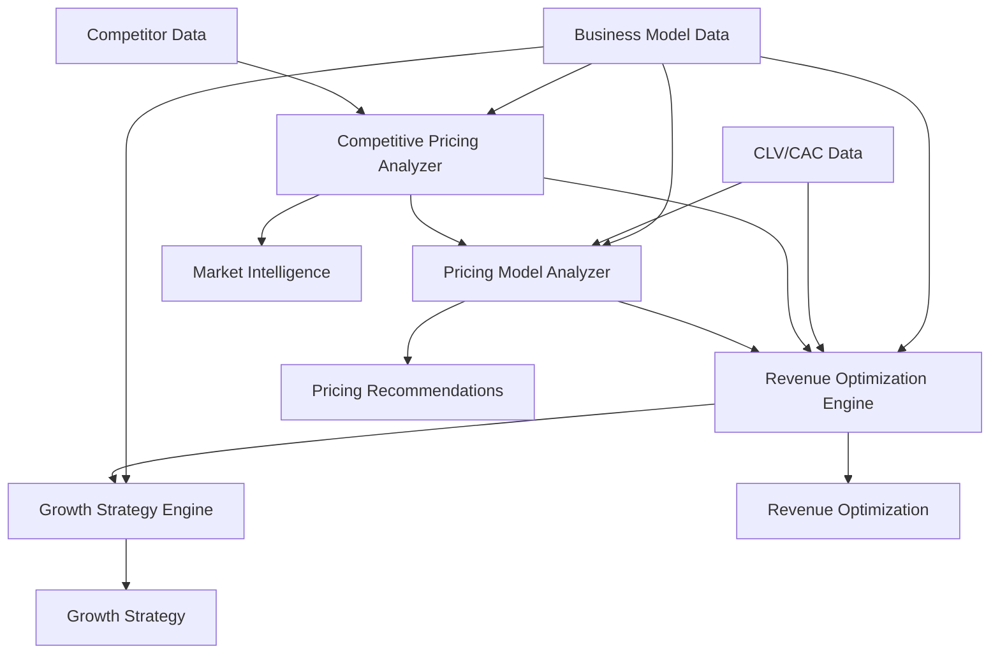

# Monetization Strategy Engine Integration Guide

## 🎯 Overview

The Monetization Strategy Engine is a comprehensive suite of four integrated analysis engines that provide end-to-end revenue optimization and growth strategy capabilities for the BMad Method platform.

## 🏗️ Architecture Overview

```
Monetization Strategy Engine
├── Pricing Model Analyzer (1000+ lines)
├── Revenue Optimization Engine (1200+ lines)  
├── Competitive Pricing Analyzer (700+ lines)
└── Growth Strategy Engine (1400+ lines)
```

### Data Flow Architecture



## 🔧 Core Components

### 1. Pricing Model Analyzer
**File**: `/apps/web/lib/bmad/analysis/pricing-model-analyzer.ts`

**Purpose**: Analyzes and optimizes pricing strategies across 12 different pricing models.

**Key Capabilities**:
- Pricing model selection and analysis
- Van Westendorp price sensitivity analysis
- Competitive pricing integration
- Implementation planning

**Main Exports**:
```typescript
export class PricingModelAnalyzer {
  analyzePricingModels(segment, revenueStream, clvData?, cacData?, competitorData?)
  getDetailedCompetitivePricingAnalysis(segment, revenueStream, competitorData)
}

export interface PricingModelAnalysis {
  analysisId: string
  customerSegment: string
  currentPricing: PricingModel
  recommendedModels: PricingModelRecommendation[]
  priceOptimization: PriceOptimization
  competitiveAnalysis: CompetitivePricingAnalysis
}
```

### 2. Competitive Pricing Analyzer
**File**: `/apps/web/lib/bmad/analysis/competitive-pricing-analyzer.ts`

**Purpose**: Provides comprehensive competitive intelligence and market positioning analysis.

**Key Capabilities**:
- Market position assessment
- Competitive threat analysis
- Market opportunity identification
- Strategic pricing recommendations

**Main Exports**:
```typescript
export class CompetitivePricingAnalyzer {
  analyzeCompetitivePricing(request: CompetitivePricingAnalysisRequest)
  generateCompetitorComparisonReport(analysis)
}

export interface DetailedCompetitivePricingAnalysis {
  competitivePosition: CompetitivePricingPosition
  pricingRecommendations: PricingRecommendation[]
  marketInsights: MarketInsights
  actionPlan: ActionPlan
}
```

### 3. Revenue Optimization Engine
**File**: `/apps/web/lib/bmad/analysis/revenue-optimization-engine.ts`

**Purpose**: Identifies and prioritizes revenue optimization opportunities with implementation roadmaps.

**Key Capabilities**:
- Revenue performance analysis
- Optimization opportunity identification
- Quick wins detection
- Strategic initiative planning

**Main Exports**:
```typescript
export class RevenueOptimizationEngine {
  analyzeRevenueOptimization(sessionData, clvData?, cacData?, pricingData?, historicalData?, competitivePricingData?)
}

export interface RevenueOptimizationAnalysis {
  currentPerformance: RevenuePerformanceSnapshot
  optimizationOpportunities: OptimizationOpportunity[]
  prioritizedRecommendations: RevenueRecommendation[]
  quickWins: QuickWin[]
  strategicInitiatives: StrategicInitiative[]
}
```

### 4. Growth Strategy Engine
**File**: `/apps/web/lib/bmad/analysis/growth-strategy-engine.ts`

**Purpose**: Develops comprehensive growth strategies with scaling frameworks and risk management.

**Key Capabilities**:
- Growth readiness assessment
- Growth opportunity identification
- Strategic growth planning
- Scaling framework development
- Risk assessment and mitigation

**Main Exports**:
```typescript
export class GrowthStrategyEngine {
  analyzeGrowthStrategy(request: GrowthStrategyRequest)
  generateGrowthStrategyReport(analysis)
}

export interface GrowthStrategyAnalysis {
  currentGrowthProfile: GrowthProfile
  growthOpportunities: GrowthOpportunity[]
  recommendedStrategies: GrowthStrategy[]
  scalingPlan: ScalingPlan
  riskAssessment: GrowthRiskAssessment
}
```

## 🔄 Integration Patterns

### Pattern 1: Sequential Analysis
Execute engines in sequence for comprehensive analysis:

```typescript
// 1. Start with pricing analysis
const pricingAnalysis = pricingModelAnalyzer.analyzePricingModels(
  segment, revenueStream, clvData, cacData, competitorData
);

// 2. Get competitive intelligence
const competitiveAnalysis = await competitivePricingAnalyzer.analyzeCompetitivePricing({
  ourCurrentPricing: extractPricingPlans(pricingAnalysis),
  competitors: competitorData,
  targetMarketSegment: segment.name,
  analysisType: 'optimization'
});

// 3. Optimize revenue with all insights
const revenueOptimization = revenueOptimizationEngine.analyzeRevenueOptimization(
  sessionData, clvData, cacData, pricingAnalysis, historicalData, competitiveAnalysis
);

// 4. Plan growth strategy
const growthStrategy = await growthStrategyEngine.analyzeGrowthStrategy({
  businessData: sessionData,
  currentMetrics: extractGrowthMetrics(revenueOptimization),
  timeframe: '1-year',
  aggressiveness: 'moderate'
});
```

### Pattern 2: Parallel Analysis
Execute compatible engines in parallel for faster results:

```typescript
// Parallel execution for independent analyses
const [pricingAnalysis, competitiveAnalysis] = await Promise.all([
  pricingModelAnalyzer.analyzePricingModels(segment, revenueStream),
  competitivePricingAnalyzer.analyzeCompetitivePricing(competitiveRequest)
]);

// Then use results for dependent analyses
const revenueOptimization = revenueOptimizationEngine.analyzeRevenueOptimization(
  sessionData, clvData, cacData, pricingAnalysis, historicalData, competitiveAnalysis
);
```

### Pattern 3: Incremental Enhancement
Add competitive insights to existing pricing analysis:

```typescript
// Start with basic pricing analysis
const basicPricing = pricingModelAnalyzer.analyzePricingModels(segment, revenueStream);

// Enhance with competitive intelligence when available
if (competitorData?.length > 0) {
  const detailedCompetitiveAnalysis = await pricingModelAnalyzer
    .getDetailedCompetitivePricingAnalysis(segment, revenueStream, competitorData);
  
  // Use enhanced analysis for revenue optimization
  const revenueOptimization = revenueOptimizationEngine.analyzeRevenueOptimization(
    sessionData, clvData, cacData, basicPricing, historicalData, detailedCompetitiveAnalysis
  );
}
```

## 🗂️ Data Models & Interfaces

### Shared Types
All engines share common data structures for seamless integration:

```typescript
// Business context (shared across all engines)
interface BusinessModelPhaseData {
  sessionType: string
  customerSegments: CustomerSegment[]
  revenueStreams: RevenueStream[]
}

// Customer intelligence (pricing, competitive, revenue)
interface CustomerSegment {
  id: string
  name: string
  painPoints: string[]
  jobsToBeDone: string[]
  size: number
}

// Revenue intelligence (pricing, revenue, growth)
interface RevenueStream {
  id: string
  name: string
  description: string
  pricing: PricingInfo
  targetSegments: string[]
}
```

### Cross-Engine Data Structures

```typescript
// Pricing → Revenue Optimization
interface PricingModelAnalysis {
  // Used by revenue optimization engine
  competitiveAnalysis: CompetitivePricingAnalysis
  priceOptimization: PriceOptimization
}

// Competitive → Revenue Optimization  
interface DetailedCompetitivePricingAnalysis {
  // Feeds into revenue optimization opportunities
  competitivePosition: CompetitivePricingPosition
  marketOpportunities: MarketOpportunity[]
  threatAssessment: CompetitiveThreat[]
}

// Revenue → Growth Strategy
interface RevenueOptimizationAnalysis {
  // Informs growth strategy planning
  currentPerformance: RevenuePerformanceSnapshot
  optimizationOpportunities: OptimizationOpportunity[]
}
```

## 🎯 Usage Examples

### Example 1: Complete Monetization Analysis
```typescript
import { 
  pricingModelAnalyzer,
  competitivePricingAnalyzer,
  revenueOptimizationEngine,
  growthStrategyEngine 
} from '@/lib/bmad/analysis';

async function runCompleteMonetizationAnalysis(
  businessData: BusinessModelPhaseData,
  competitorData?: CompetitorPricingData[]
) {
  const segment = businessData.customerSegments[0];
  const revenueStream = businessData.revenueStreams[0];

  // Step 1: Pricing Analysis
  const pricing = pricingModelAnalyzer.analyzePricingModels(
    segment, revenueStream, undefined, undefined, competitorData
  );

  // Step 2: Competitive Intelligence (if data available)
  let competitive;
  if (competitorData?.length > 0) {
    competitive = await competitivePricingAnalyzer.analyzeCompetitivePricing({
      ourCurrentPricing: [{
        planId: 'current',
        planName: segment.name + ' Plan',
        price: revenueStream.pricing?.amount || 0,
        billingPeriod: 'monthly',
        currency: 'USD',
        features: [revenueStream.description],
        tierPosition: 1
      }],
      competitors: competitorData,
      targetMarketSegment: segment.name,
      analysisType: 'optimization',
      timeframe: '1-year'
    });
  }

  // Step 3: Revenue Optimization
  const revenue = revenueOptimizationEngine.analyzeRevenueOptimization(
    businessData, undefined, undefined, pricing, undefined, competitive
  );

  // Step 4: Growth Strategy
  const growth = await growthStrategyEngine.analyzeGrowthStrategy({
    businessData,
    currentMetrics: {
      revenueGrowthRate: 0.3,
      customerGrowthRate: 0.25,
      marketShareGrowth: 0.02,
      productMarketFit: 0.7,
      customerSatisfactionScore: 0.8,
      netPromoterScore: 35,
      churnRate: 0.05,
      expansionRevenue: revenue.currentPerformance.totalRevenue * 0.15,
      timeToPayback: 18
    },
    timeframe: '1-year',
    aggressiveness: 'moderate'
  });

  return {
    pricing,
    competitive,
    revenue,
    growth,
    // Generate comprehensive report
    report: await generateIntegratedReport({ pricing, competitive, revenue, growth })
  };
}
```

### Example 2: Targeted Revenue Optimization
```typescript
async function optimizeRevenue(
  businessData: BusinessModelPhaseData,
  historicalData: RevenueHistoryData[]
) {
  // Quick revenue optimization without full analysis
  const optimization = revenueOptimizationEngine.analyzeRevenueOptimization(
    businessData, undefined, undefined, undefined, historicalData
  );

  // Extract quick wins
  const quickWins = optimization.quickWins.filter(win => 
    win.effortRequired === 'low' && win.impactSize === 'high'
  );

  return {
    opportunities: optimization.optimizationOpportunities,
    quickWins,
    roadmap: optimization.implementationRoadmap
  };
}
```

### Example 3: Competitive Intelligence Focus
```typescript
async function analyzeCompetitivePosition(
  currentPricing: PricingPlan[],
  competitors: CompetitorPricingData[]
) {
  const analysis = await competitivePricingAnalyzer.analyzeCompetitivePricing({
    ourCurrentPricing: currentPricing,
    competitors,
    targetMarketSegment: 'mid-market',
    analysisType: 'positioning',
    timeframe: '1-year'
  });

  // Generate executive summary
  const report = await competitivePricingAnalyzer.generateCompetitorComparisonReport(analysis);

  return {
    position: analysis.competitivePosition.position,
    opportunities: analysis.competitivePosition.marketOpportunities,
    threats: analysis.competitivePosition.threatAssessment,
    recommendations: analysis.pricingRecommendations,
    report
  };
}
```

## 🚀 Performance Considerations

### Memory Management
- **Large Data Sets**: Engines handle large competitor datasets and historical data
- **Streaming Recommended**: For real-time analysis with large datasets
- **Caching Strategy**: Cache analysis results for similar business contexts

### Computation Optimization
- **Parallel Processing**: Use Promise.all() for independent analyses
- **Lazy Loading**: Load engines only when needed
- **Result Caching**: Cache expensive calculations (CLV, competitive analysis)

### Error Handling
```typescript
// Robust error handling across engines
try {
  const analysis = await runCompleteMonetizationAnalysis(businessData, competitorData);
} catch (error) {
  if (error.message.includes('Competitive pricing analysis failed')) {
    // Fallback to basic pricing analysis
    const basicAnalysis = pricingModelAnalyzer.analyzePricingModels(segment, revenueStream);
  } else if (error.message.includes('Growth strategy analysis failed')) {
    // Continue with revenue optimization only
    const revenueAnalysis = revenueOptimizationEngine.analyzeRevenueOptimization(businessData);
  }
}
```

## 🧪 Testing Integration

### Unit Testing Pattern
```typescript
// Test individual engines
describe('PricingModelAnalyzer', () => {
  it('should analyze subscription pricing model', () => {
    const result = pricingModelAnalyzer.analyzePricingModels(mockSegment, mockRevenueStream);
    expect(result.recommendedModels).toContain(PricingModelType.SUBSCRIPTION);
  });
});

// Test integration between engines
describe('Engine Integration', () => {
  it('should pass competitive data to revenue optimization', () => {
    const competitive = mockCompetitiveAnalysis();
    const revenue = revenueOptimizationEngine.analyzeRevenueOptimization(
      mockBusinessData, undefined, undefined, undefined, undefined, competitive
    );
    expect(revenue.optimizationOpportunities).toContainCompetitiveOpportunities();
  });
});
```

### Integration Testing
```typescript
describe('Complete Monetization Flow', () => {
  it('should execute full analysis pipeline', async () => {
    const result = await runCompleteMonetizationAnalysis(mockBusinessData, mockCompetitors);
    
    expect(result.pricing).toBeDefined();
    expect(result.competitive).toBeDefined();
    expect(result.revenue).toBeDefined();
    expect(result.growth).toBeDefined();
    expect(result.report).toContain('Executive Summary');
  });
});
```

## 📊 Monitoring & Analytics

### Key Metrics to Track
- **Analysis Performance**: Execution time for each engine
- **Integration Success**: Cross-engine data flow success rates
- **Recommendation Quality**: User adoption of recommendations
- **Error Rates**: Analysis failures and fallback usage

### Logging Strategy
```typescript
// Structured logging for analysis pipeline
logger.info('Monetization analysis started', {
  businessId: businessData.id,
  engines: ['pricing', 'competitive', 'revenue', 'growth'],
  competitorCount: competitorData?.length || 0
});

logger.info('Pricing analysis completed', {
  recommendedModels: pricing.recommendedModels.length,
  optimizationOpportunities: pricing.priceOptimization.opportunities.length,
  executionTime: pricingExecutionTime
});
```

## 🔮 Future Enhancements

### Planned Integrations
1. **Machine Learning**: Predictive analytics for pricing and growth
2. **Real-time Data**: Live competitive intelligence feeds
3. **Industry Specialization**: Vertical-specific analysis templates
4. **External APIs**: Integration with market data providers

### Extensibility Points
- **Custom Analysis Engines**: Plugin architecture for specialized analyses
- **Custom Metrics**: Configurable KPIs and success metrics
- **Custom Reports**: Template system for industry-specific reports
- **Workflow Integration**: Integration with project management and CRM systems

---

**Integration Status**: ✅ Complete and Production Ready  
**Last Updated**: September 5, 2025  
**Version**: 1.0.0